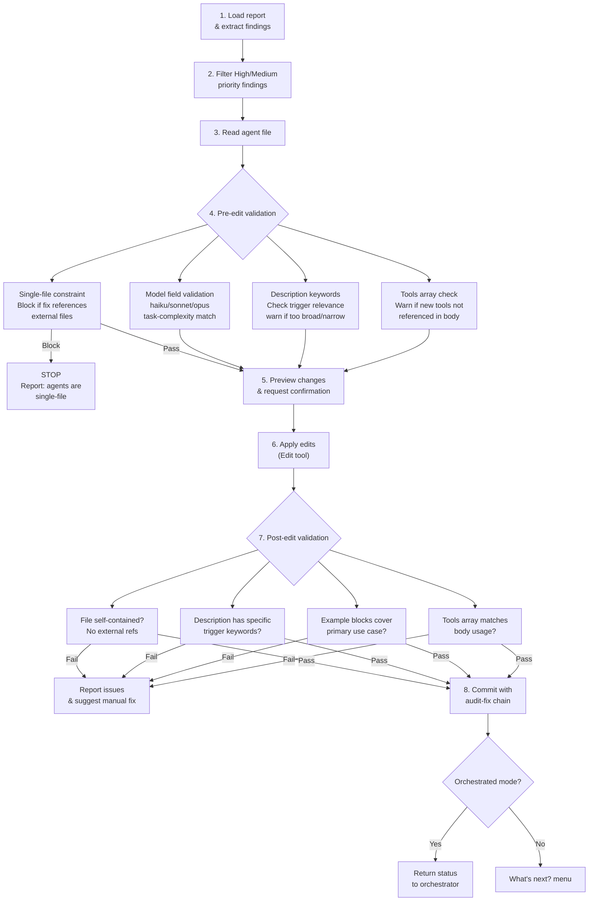

# apply-agent-review-findings

Apply High and Medium priority recommendations from a `review-agent` report to the reviewed agent file. Includes agent-specific validation for single-file constraint, model selection, description keywords, and tools array consistency.

## Overview

| Property | Value |
|----------|-------|
| **Name** | apply-agent-review-findings |
| **Location** | `skills/apply-agent-review-findings/SKILL.md` |
| **Type** | Fix/Apply |
| **Allowed Tools** | Read, Edit, Glob, Bash |
| **disable-model-invocation** | true |
| **Argument Hint** | `[report-path]` |
| **Mode** | Standalone + Orchestrated |
| **Research Behavior** | None (no web research) |

## Purpose

The skill reads a `review-agent` report, extracts all High and Medium priority findings, and applies the recommended fixes to the reviewed agent file. Low priority findings are intentionally skipped.

Because agents are single-file primitives, the skill enforces constraints that differ from skill-level fixes: no external reference directories, no multi-file sprawl, and strict validation that the agent file remains self-contained after edits.

## Workflow



### Step 1: Load report and extract findings

If `$ARGUMENTS` provides a report path, use it directly. Otherwise, locate the most recent `review-agent` report in `.claude/reviews/` by timestamp.

Read the report and parse the findings list from the review body. Each finding includes priority (High/Medium/Low), the recommendation text, and evidence.

### Step 2: Filter to High and Medium priority

Discard all Low priority findings. Build a work list of High and Medium findings ordered by priority (High first).

If no High or Medium findings exist, output a summary ("No actionable findings") and exit.

### Step 3: Read the agent file

Extract the reviewed file path from the report frontmatter. Read the agent file to establish the current state before edits.

### Step 4: Pre-edit validation (agent-specific)

Run four agent-specific checks before applying any edits:

**Single-file constraint.** Scan each recommendation for references to external files (`references/`, `includes/`, creating new files). If any recommendation would require creating files outside the agent file, **block that finding** and report: "Agents are single-file. This recommendation cannot be applied." Continue with remaining findings.

**Model field validation.** If a finding changes the `model` field, validate the new value against task complexity:

| Model | Appropriate For |
|-------|-----------------|
| `haiku` | Simple routing, quick checks, classification |
| `sonnet` | Analysis, review, moderate reasoning (default) |
| `opus` | Complex multi-step reasoning, nuanced judgment |

Warn if the model seems mismatched for the agent's described purpose but do not block.

**Description keywords.** If a finding modifies the `description` field, check that the new text contains specific trigger keywords relevant to the agent's purpose. Warn if the description is too broad ("help with tasks") or too narrow (overly specific single phrase).

**Tools array consistency.** If a finding adds entries to the `tools` array, verify that the agent body references those tools. Warn on tools listed but never mentioned in the instructions.

### Step 5: Preview changes and request confirmation

Present a summary of all changes that will be applied:

```
## Planned Edits

### Finding 1 (High): <title>
- Current: <relevant excerpt>
- Proposed: <new text>

### Finding 2 (Medium): <title>
- Current: <relevant excerpt>
- Proposed: <new text>

Blocked findings: <count, if any>
Warnings: <list, if any>

Proceed? (confirm to apply)
```

Wait for user confirmation before applying any edits. In orchestrated mode, the orchestrator provides confirmation.

### Step 6: Apply edits

Use the Edit tool to apply each approved change to the agent file. Apply changes in document order (top to bottom) to avoid offset drift.

No new files are created. All changes are edits to the single agent file.

### Step 7: Post-edit validation (agent-specific)

After all edits are applied, re-read the agent file and run four validation checks:

**Self-contained check.** Scan the edited file for references to non-existent external files. Agent files must be fully self-contained.

**Description trigger keywords.** Verify the description contains specific, relevant trigger keywords -- not generic phrases like "help with tasks" or "assist the user."

**Example block coverage.** Confirm that `<example>` blocks exist and cover the agent's primary use case. Warn if no examples are present or if examples only cover edge cases.

**Tools array consistency.** Compare the `tools` array against actual tool references in the body. Warn on mismatches in either direction (listed but unused, used but unlisted).

If any validation fails, report the issues and suggest manual corrections. Do not attempt automated repair of validation failures.

### Step 8: Commit with audit-fix chain

Follow the audit-fix chain convention:

1. The review report should already be committed (by the review skill). If not, note this.
2. Commit the agent file changes with: `fix(agents): address findings from <timestamp> review`

The timestamp in the commit message links the fix to the originating report.

## Hard Rules

- **Edit-only.** Never create new files. Agents are single-file primitives.
- **Single-file constraint.** Never create reference directories, include files, or any external dependencies for agents.
- **Scope restriction.** Only modify the file identified in the review report.
- **Preview before edit.** Always show planned changes and wait for confirmation.
- **Audit-fix chain.** Commit message must reference the review report timestamp.
- **No Low impact changes.** Only apply High and Medium priority findings.
- **disable-model-invocation: true.** This skill modifies files and requires explicit user confirmation.

## Reference Files

| File | Purpose |
|------|---------|
| `references/agent-fix-guide.md` (own) | Agent-specific validation rules and single-file constraints |
| `apply-review-findings/references/commit-conventions.md` (shared) | Commit message format for audit-fix chain |

## Interactions

| Direction | Target | Notes |
|-----------|--------|-------|
| Called by | `apply-review-findings` | Orchestrated mode, receives report path |
| Called by | User directly | Standalone invocation |
| Calls | Nothing | Terminal skill in the fix chain |
