# apply-audit-findings

> Apply recommended primitives from an audit-repo report to the target repository. Creates CLAUDE.md sections, rules, and hook configurations. Delegates skill creation to /scaffold-skill. Previews every change with user confirmation and commits with audit-fix chain convention.

**Command:** `/apply-audit-findings [report-path]`
**Location:** `skills/apply-audit-findings/SKILL.md`
**Type:** Fix/Apply
**Allowed Tools:** Read, Write, Edit, Glob, Bash
**disable-model-invocation:** true
**Mode Support:** Standalone only

## Overview

The apply-audit-findings skill translates an audit-repo intervention matrix into concrete Claude Code primitives in a target repository. Where `/apply-review-findings` edits existing files based on review recommendations, this skill creates new files and appends new sections -- it builds infrastructure that did not previously exist.

The skill reads a structured audit-repo report (schema v2), extracts the intervention matrix mapping error classes to recommended primitives, and walks the user through creating each primitive with previews and confirmation gates. It handles four primitive types: CLAUDE.md sections (appended or created), hooks (script + settings.local.json), rules (plain Markdown in `.claude/rules/`), and skills (deferred to `/scaffold-skill` -- never created inline).

Interventions are processed in priority order (P0, then P1, then P2), and within each priority group by primitive type (CLAUDE.md, Hook, Rule, Skill). Every write operation is preceded by a preview and requires explicit user confirmation. The skill enforces idempotency checks (duplicate detection, existence checks) and budget warnings (CLAUDE.md >200 lines).

Because the skill has `disable-model-invocation: true`, it runs without spawning sub-agents. It operates exclusively on the target repository from the report -- never the plugin repo.

## Process Flow Diagram

```mermaid
flowchart TD
    Start["Start: /apply-audit-findings [report-path]"] --> S1

    %% Phase 1: Parse
    S1["1. Locate audit report<br/>$ARGUMENTS or Glob<br/>*/.claude/reviews/*-audit-repo.md"] --> S1Check{"Report found?<br/>generated_by = audit-repo?<br/>schema_version = 2?"}
    S1Check -- No --> S1Err["Report validation error.<br/>STOP"]
    S1Check -- Yes --> S2["2. Parse intervention matrix<br/>Frontmatter summary array +<br/>body recommendations<br/>Mark entries without code blocks<br/>as manual"]
    S2 --> S3["3. Load references<br/>- primitive-creation-guide.md<br/>- claudemd-section-patterns.md<br/>- commit-conventions.md (shared)"]
    S3 --> S4

    %% Phase 2: Present summary
    S4["4. Present summary table<br/>All interventions with<br/>planned actions"] --> S4Confirm{"User: Apply?<br/>(yes/no)"}
    S4Confirm -- No --> S4Stop["STOP"]
    S4Confirm -- Yes --> S5

    %% Phase 3: Resolve target
    S5["5. Resolve target repository<br/>Validate exists + is git repo"] --> PriorityLoop

    %% Phase 4: Priority group loop
    subgraph PriorityLoop ["6. Apply Interventions by Priority Group"]
        direction TB
        PG["Select next priority group<br/>P0 → P1 → P2"] --> TypeOrder{"Primitive type?"}

        TypeOrder -- "CLAUDE.md" --> CM["CLAUDE.md Branch<br/>1. Read/create CLAUDE.md<br/>2. Section pattern placement<br/>3. Dedup check (3+ key terms)<br/>4. Preview content + placement<br/>5. Ask: yes/skip/stop<br/>6. Apply via Edit/Write<br/>7. Post-edit line count check<br/>   (warn >200 lines)"]

        TypeOrder -- "Hook" --> HK["Hook Branch<br/>1. Check settings.local.json<br/>   for existing hooks<br/>2. Determine script path<br/>3. Preview config + script<br/>4. Ask: yes/skip/stop<br/>5. Write script + chmod +x<br/>6. Update settings JSON<br/>7. Validate executable + JSON"]

        TypeOrder -- "Rule" --> RL["Rule Branch<br/>1. Determine path<br/>   .claude/rules/<kebab-name>.md<br/>2. Check exists (warn if so)<br/>3. mkdir -p .claude/rules/<br/>4. Validate: no frontmatter,<br/>   strong verbs, scope qualifiers<br/>5. Preview path + content<br/>6. Ask: yes/skip/stop<br/>7. Write file"]

        TypeOrder -- "Skill" --> SK["Skill Branch<br/>(NO creation)<br/>1. Present recommendation<br/>2. Suggest /scaffold-skill<br/>   plugin <name><br/>3. Record as Deferred"]

        CM --> MoreTypes{"More interventions<br/>in this group?"}
        HK --> MoreTypes
        RL --> MoreTypes
        SK --> MoreTypes
        MoreTypes -- Yes --> TypeOrder
        MoreTypes -- No --> MorePriority{"More priority<br/>groups?"}
        MorePriority -- Yes --> PG
        MorePriority -- No --> Results
    end

    %% Phase 5: Results + Commit
    Results["7. Aggregate results table<br/>Applied / Deferred /<br/>Skipped / Manual counts"] --> AnyChanges{"Any changes<br/>applied or deferred?"}
    AnyChanges -- No --> FinalStop["STOP"]
    AnyChanges -- Yes --> CommitFlow

    subgraph CommitFlow ["8. Audit-Fix Chain Commit"]
        direction TB
        GitCheck{"Target is<br/>git repo?"} -- No --> SkipCommit["Skip commit workflow<br/>(changes already applied)"]
        GitCheck -- Yes --> ReportCheck["Check if audit report<br/>is committed<br/>(git log)"]
        ReportCheck --> ReportCommitted{"Report<br/>committed?"}
        ReportCommitted -- No --> OfferReport["Offer to commit report:<br/>docs(reviews): add<br/><timestamp> audit-repo report"]
        ReportCommitted -- Yes --> ScopeDetect
        OfferReport --> ReportConfirm{"Commit report?<br/>(yes/no)"}
        ReportConfirm -- Yes --> StageReport["Stage and commit<br/>report via Bash"]
        ReportConfirm -- No --> ScopeDetect
        StageReport --> ScopeDetect
        ScopeDetect["Determine scope:<br/>- CLAUDE.md only → project<br/>- Mixed → claude-config<br/>- Single primitive → name"]
        ScopeDetect --> FixCommit["Compose:<br/>fix(<scope>): apply interventions<br/>from <timestamp> audit"]
        FixCommit --> FixConfirm{"Commit fixes?<br/>(yes/no)"}
        FixConfirm -- Yes --> StageCommit["Stage and commit<br/>via Bash"]
        FixConfirm -- No --> Uncommitted["Changes applied<br/>but uncommitted"]
    end

    SkipCommit --> FinalReport
    StageCommit --> FinalReport
    Uncommitted --> FinalReport

    FinalReport["9. Final status:<br/>- Files created/modified<br/>- Commits (with hashes)<br/>- Deferred skills<br/>- Manual interventions"]
    FinalReport --> Menu["What's next?<br/>1. /scaffold-skill plugin <name><br/>2. /audit-repo <target><br/>3. /review-claude-config <target><br/>4. Done"]
```



## Process Steps

### Step 1: Locate the audit report

If `$ARGUMENTS` contains a file path, use it directly. Otherwise, Glob `*/.claude/reviews/*-audit-repo.md` and select the most recent report by filename timestamp.

Read the report file. Parse the YAML frontmatter. Validate two fields:
- `generated_by` must be `audit-repo`. If not: "This skill applies audit-repo reports only. Found `generated_by: [value]`. Use `/apply-review-findings` for review reports." Stop.
- `schema_version` must be `2`. If not: "This skill requires schema v2 audit reports. Found version [N]." Stop.

### Step 2: Parse the intervention matrix

Extract the `summary` array from the frontmatter. Each entry must include the core fields `error_class`, `gap`, `primitive`, `priority`, and `token_impact`.

Ignore additive metadata fields the applier does not need (for example `evidence_class` or `confidence`). They are valid schema extensions and should not break parsing.

Parse the report body for **Recommendations** sections (organized by P0/P1/P2). Each recommendation has a numbered heading matching the intervention matrix row, a description, and one or more fenced code blocks with concrete content.

Match each frontmatter summary entry to its body recommendation by intervention number. If an intervention has no matching body recommendation with a concrete content block, mark it as `manual` -- present it to the user but do not attempt automated application.

### Step 3: Load references

Read from this skill's own `references/` directory:
- `references/primitive-creation-guide.md` -- validation rules per primitive type
- `references/claudemd-section-patterns.md` -- section matching and placement logic

Locate the shared commit conventions file via Glob: `**/apply-review-findings/references/commit-conventions.md`. If not found, warn but continue -- commit message guidance will use defaults.

### Step 4: Present summary table

Show all interventions with their planned action:

```
## Audit Interventions

| # | Error Class | Gap | Primitive | Priority | Action |
|---|-------------|-----|-----------|----------|--------|
| 1 | Navigation | repository.py 1,969 lines | CLAUDE.md | P0 | Append section |
| 2 | Convention | No linter/formatter | Hook | P1 | Create hook |
| 6 | Security | No secret detection | Rule | P2 | Create rule |
| 8 | Repetition | k8s manifest patterns | Skill | P2 | Defer to /scaffold-skill |

Total: N interventions (N auto, N manual, N deferred)
```

Ask: "Apply these interventions? (yes/no)". If no, stop.

### Step 5: Resolve the target repository

Extract the `target` field from the frontmatter. Validate:
- The target directory exists
- It is a git repository (`git -C <target> rev-parse --git-dir`)

If the target is not a git repo, warn: "Target is not a git repository. Changes will be applied but the commit workflow will be skipped." Continue without commit steps.

### Step 6: Apply interventions by priority group

Process groups in order: P0, then P1, then P2. Within each priority group, process by primitive type: CLAUDE.md, Hook, Rule, Skill.

#### CLAUDE.md Interventions

1. **Read or create CLAUDE.md.** Read `<target>/CLAUDE.md`. If it does not exist, create it with a minimal header (`# <repo-directory-name>` and a blank line).
2. **Determine placement.** Use `references/claudemd-section-patterns.md` to map the intervention's `error_class` to a target section header. Grep for the header and fallback headers. If a match exists, plan to append below it (before the next `##`). If no match, plan to create a new `##` section before trailing reference sections.
3. **Deduplication check.** Grep for 3+ consecutive key terms from the new content. If found, warn: "Similar content may already exist at line N" and show the existing text.
4. **Preview.** Show the section header, content to be added, and placement location.
5. **Ask:** "Apply this CLAUDE.md change? (yes/skip/stop)"
6. **Apply.** Use Edit (append after matched section) or Write (if creating new CLAUDE.md).
7. **Post-edit validation.** Check total line count. If >200 lines, warn: "CLAUDE.md is now [N] lines (budget: <200). Consider extracting content to reference files."

#### Hook Interventions

1. **Check for existing hooks.** Read `<target>/.claude/settings.local.json` if it exists. If the recommended hook matcher already exists, warn and ask whether to skip or overwrite.
2. **Determine script path.** `<target>/hooks/<script-name>`. Create the `hooks/` directory if needed (`mkdir -p`).
3. **Preview.** Show the hook configuration entry (type, matcher, command) and script content.
4. **Ask:** "Create this hook? (yes/skip/stop)"
5. **Write.** Write the script file, set executable permission (`chmod +x`), and update `settings.local.json` with the hook entry.
6. **Post-edit validation.** Verify the script file exists and is executable. Verify the settings JSON is valid.

#### Rule Interventions

1. **Determine path.** `<target>/.claude/rules/<rule-name>.md` where `rule-name` is derived from the gap description in kebab-case (e.g., "No secret detection" becomes `no-secrets.md`).
2. **Check existence.** If the file already exists, warn and ask whether to skip or overwrite.
3. **Create directory.** `mkdir -p <target>/.claude/rules/` if needed.
4. **Validate content.** The rule text must be plain Markdown with no YAML frontmatter. It must use strong action verbs ("must", "never", "always") and include scope qualifiers.
5. **Preview.** Show the file path and full rule content.
6. **Ask:** "Create this rule? (yes/skip/stop)"
7. **Write.** Write the file using the Write tool.

#### Skill Interventions

Skills are never created inline. The skill presents the recommendation details and suggests the user run `/scaffold-skill plugin <name>` separately. The intervention is recorded as "Deferred to /scaffold-skill" in the results table. No confirmation is needed because nothing is written.

### Step 7: Aggregate results

Show a combined results table:

```
## Changes Applied

| # | Gap | Primitive | Priority | Status |
|---|-----|-----------|----------|--------|
| 1 | repository.py navigation | CLAUDE.md | P0 | Applied |
| 2 | No linter/formatter | Hook | P1 | Applied |
| 6 | No secret detection | Rule | P2 | Skipped |
| 8 | k8s manifest patterns | Skill | P2 | Deferred to /scaffold-skill |

Applied: N / Deferred: N / Skipped: N / Manual: N
```

If no changes were applied and none were deferred, stop here.

### Step 8: Commit with audit-fix chain

**Report commit check:** Run `git -C <target> log --oneline --all -- <report-path>` to verify the report is already committed. If not, offer to commit it first with the message `docs(reviews): add <timestamp> audit-repo report`.

**Scope detection:** Determine the commit scope from the modified files:
- All changes are CLAUDE.md only: scope is `project`
- Mixed primitive types: scope is `claude-config`
- Single non-CLAUDE.md primitive: scope is the primitive name (e.g., `no-secrets`)

**Fix commit:** Compose the message `fix(<scope>): apply interventions from <timestamp> audit`. Show the message and list of files to be staged. Ask: "Commit these changes? (yes/no)". If the commit fails, report the error and advise manual resolution.

If the target is not a git repository, this entire step is skipped.

### Step 9: Report and next steps

Present the final status:
- Files created (with paths)
- Files modified (with paths)
- Commits created (with hashes)
- Deferred skill interventions (with the `/scaffold-skill` commands to run)
- Interventions marked manual (with descriptions)

Then show the "What's next?" menu:

```
---
**What's next?**
1. Scaffold a deferred skill -> `/scaffold-skill plugin <name>`
2. Verify coverage -> `/audit-repo <target>`
3. Review created primitives -> `/review-claude-config <target>`
4. Done

_Type a number to continue._

---
```

## Hard Rules

1. **Target repo only.** All file operations happen in the target repository from the report's `target` field. Never modify the plugin repo or any files outside the target.
2. **Preview before every change.** Show the full content to be created or appended before any write operation.
3. **User confirmation at every stage.** Confirm before starting (Step 4), before each intervention (Step 6), and before each commit (Step 8).
4. **No inline skill creation.** Skill-type interventions are always deferred to `/scaffold-skill`. Never write SKILL.md files.
5. **Audit-fix chain.** Always commit the audit report before committing intervention fixes. Use the report timestamp in the fix commit message.
6. **CLAUDE.md budget.** Warn if CLAUDE.md exceeds 200 lines after edits. Suggest extracting content to reference files.
7. **Rules have no frontmatter.** Rule files are plain Markdown. Never add YAML `---` delimiters.
8. **Idempotency.** Before creating a file, check if it already exists. Before appending to CLAUDE.md, check for duplicate content (3+ key terms). Warn and ask before overwriting.
9. **Append-only for CLAUDE.md.** Never modify or remove existing CLAUDE.md sections. Only append new content or new sections.
10. **No CLAUDE.md, no problem.** If the target has no CLAUDE.md, create one with a `# <repo-name>` header before appending sections.
11. **Graceful degradation.** If the target is not a git repo, skip the commit workflow but still apply file changes.

## Research Behavior

None. This skill performs no web research. It operates entirely on local files.

## Reference Files

| File | Location | Purpose |
|------|----------|---------|
| `primitive-creation-guide.md` | `apply-audit-findings/references/` (own) | Validation rules per primitive type |
| `claudemd-section-patterns.md` | `apply-audit-findings/references/` (own) | Section matching and placement logic |
| `commit-conventions.md` | `apply-review-findings/references/` (shared) | Scoped conventional commit format and audit-fix chain linking rules |

## Interactions

| Direction | Target | Notes |
|-----------|--------|-------|
| Called by | User directly | Invoked after `/audit-repo` produces a report |
| Calls | Nothing directly | Defers skill creation to `/scaffold-skill` via user |
| Shares references with | `/apply-review-findings` | Commit conventions file |
| May suggest | `/scaffold-skill plugin <name>` | Via "What's next?" menu for deferred skill interventions |
| May suggest | `/audit-repo <target>` | Via "What's next?" menu to verify coverage |
| May suggest | `/review-claude-config <target>` | Via "What's next?" menu to review created primitives |
