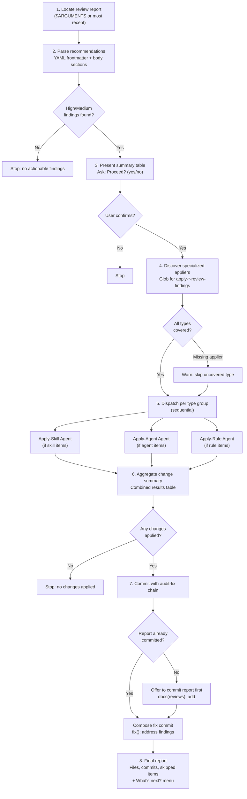

# apply-review-findings

Thin orchestrator that locates review reports, classifies items by type, and delegates fix application to specialized appliers (apply-skill/agent/rule-review-findings). Handles report parsing, summary presentation, and the commit workflow.

## Overview

| Property | Value |
|----------|-------|
| **Name** | apply-review-findings |
| **Location** | `skills/apply-review-findings/SKILL.md` |
| **Type** | Fix/Apply (Orchestrator) |
| **Allowed Tools** | Read, Edit, Glob, Bash |
| **disable-model-invocation** | true |
| **Argument Hint** | `[report-path]` |
| **Mode** | Standalone only (it IS the orchestrator) |
| **Research Behavior** | None (no web research) |

## Purpose

After any `/review-*` skill produces a report, the user invokes `/apply-review-findings` to act on the recommendations. Rather than implementing fix logic itself, this skill orchestrates the process: it parses the report, groups findings by item type, and dispatches each group to a specialized applier that understands the type-specific constraints. The orchestrator owns the end-to-end workflow (report location, summary, commit chain) while specialized appliers own the edit logic and type-specific validation.

This separation means the orchestrator never needs to understand skill frontmatter rules, agent activation patterns, or rule trigger syntax. It only needs to route correctly and manage the commit lifecycle.

## Workflow



### Step 1: Locate the review report

If `$ARGUMENTS` contains a file path, use it directly. Otherwise, Glob `.claude/reviews/*-review-*.md` and select the most recent report by filename timestamp.

Read the report file. Validate that `generated_by` in the YAML frontmatter is one of: `review-claude-config`, `review-skill`, `review-agent`, `review-rule`. If the file does not exist or `generated_by` is invalid, report the error and stop.

### Step 2: Parse recommendations

Extract the YAML frontmatter to get: `date`, `target`, `generated_by`, and `summary` (list of items with paths, types, and grades).

Parse the report body for recommendation sections. Each recommendation follows the pattern:

```
#### N. Title (Impact: High/Medium/Low[, Category: ...])

**Evidence:** [text]

**Why it matters:** [text]

**Validation:** [text]

**Current:**
```[code block]```

**Recommended:**
```[code block]```
```

Some recommendations may lack Current/Recommended blocks (structural suggestions). The full structured text is passed to the specialized applier regardless.

Filter to **High and Medium impact only**. Discard Low impact recommendations.

If no High or Medium recommendations are found, tell the user: "No actionable findings -- all recommendations are Low impact." Stop.

Group recommendations by item type using the `type` field in the `summary` array (Skill, Agent, or Rule). For single-item reports (`review-skill`, `review-agent`, `review-rule`), there is one group.

### Step 3: Present summary

Show a summary table of all actionable findings before making any changes:

```
## Actionable Findings

| # | Item | Type | Recommendation | Impact | File |
|---|------|------|----------------|--------|------|
| 1 | review-skill | Skill | Add confirmation gate | Medium | skills/review-skill/SKILL.md |
| 2 | my-agent | Agent | Fix model selection | High | .claude/agents/my-agent.md |
```

Ask: "Proceed with applying these findings? (yes/no)". If no, stop.

### Step 4: Discover specialized appliers

Locate specialized applier skills via Glob:

| Glob Pattern | Handles Type |
|-------------|--------------|
| `**/apply-skill-review-findings/SKILL.md` | Skill |
| `**/apply-agent-review-findings/SKILL.md` | Agent |
| `**/apply-rule-review-findings/SKILL.md` | Rule |

Read each found SKILL.md and its type-specific fix guide from its `references/` directory.

If a specialized applier is not found for a type present in the report, warn: "No specialized applier found for type [Type]. Skipping [N] recommendations." Continue with remaining types.

### Step 5: Dispatch to specialized appliers

Extract the report timestamp from the filename (e.g., `2026-03-24T161200` from `2026-03-24T161200-review-skill.md`).

For each type group, process **sequentially** (edits require per-item user confirmation). Construct the orchestration payload:

```
---orchestration---
mode: orchestrated
report_timestamp: YYYY-MM-DDTHHMMSS
---

## Items to Fix

### Item: [name]
**Path:** [file path]
**Type:** [Skill|Agent|Rule]
**Recommendations:**

#### 1. [Title] (Impact: [High/Medium])
**Evidence:** [text]

**Why it matters:** [text]

**Validation:** [text]

**Current:**
```[code block]```

**Recommended:**
```[code block]```
```

Launch an Agent with the specialized SKILL.md content, its fix guide, and the orchestration payload as the prompt. The agent applies edits with user confirmation and returns structured results.

All fields (Evidence, Why it matters, Validation, Current/Recommended) are preserved in the payload so the specialized applier has full context for validation.

### Step 6: Aggregate change summary

Combine results from all specialized appliers into a single table:

```
## Changes Applied

| # | Item | Type | Recommendation | Status |
|---|------|------|----------------|--------|
| 1 | review-skill | Skill | Add confirmation gate | Applied |
| 2 | my-agent | Agent | Fix model selection | Skipped |

Applied: N / Total: M
```

If no changes were applied (all skipped or rejected by user), stop here.

### Step 7: Commit with audit-fix chain

Read `references/commit-conventions.md` for the commit format.

**Report commit check:** Run `git log --oneline --all -- <report-path>` to verify the report is already committed. If not, offer to commit it first:

> "The review report is not yet committed. The audit-fix chain convention requires committing the report first:
> `docs(reviews): add <timestamp> review report`
>
> Commit the report now? (yes/no)"

If yes, stage and commit the report via Bash.

**Fix commit:** Determine scope from the modified files. If all edits are within one skill/agent/rule, use that item's name. If multiple items were edited, use comma-separated scopes. Compose: `fix(<scope>): address findings from <timestamp> review`. Show the message, ask "Commit these changes? (yes/no)", and commit if confirmed. If the commit fails, report the error and advise manual resolution.

### Step 8: Report

Present the final status:

- Files modified
- Commits created (with hashes)
- Recommendations not applied (skipped or rejected)

Then show the "What's next?" menu. The verify command is derived from `generated_by`:

| `generated_by` | Verify Command |
|----------------|----------------|
| `review-skill` | `/review-skill <path>` |
| `review-agent` | `/review-agent <path>` |
| `review-rule` | `/review-rule <path>` |
| `review-claude-config` | `/review-claude-config <target>` |

```
---
**What's next?**
1. Verify improvements -> `<verify-command>`
2. Review a specific item
3. Done

_Type a number to continue._

---
```

## Hard Rules

1. **Edit-only operations.** Never delete files. Never create new files. Only edit existing files.
2. **Scope restriction.** Only edit files listed in the review report's `summary` section. Never edit files outside the report's scope.
3. **Preview before every edit.** Always show the current and recommended text before applying.
4. **User confirmation at every stage.** Confirm before starting, before each edit (delegated to appliers), and before committing.
5. **Audit-fix chain.** Always commit the report before committing fixes. Use the report timestamp in the fix commit message.
6. **No Low impact changes.** Only apply High and Medium recommendations. Low impact changes are left for manual application.
7. **Delegate type-specific validation.** The orchestrator does not validate edits. Specialized appliers handle all type-specific checks (frontmatter rules, activation patterns, trigger syntax).
8. **Preserve file structure.** Edits replace text blocks only. Never rewrite entire files.

## Reference Files

| File | Location | Purpose |
|------|----------|---------|
| `commit-conventions.md` | `apply-review-findings/references/` (own) | Scoped conventional commit format and audit-fix chain linking rules |

## Interactions

| Direction | Target | Notes |
|-----------|--------|-------|
| Called by | User directly | Invoked after any `/review-*` skill produces a report |
| Delegates to | `apply-skill-review-findings` | Sub-agent for Skill-type findings |
| Delegates to | `apply-agent-review-findings` | Sub-agent for Agent-type findings |
| Delegates to | `apply-rule-review-findings` | Sub-agent for Rule-type findings |
| Shares references with | All `apply-*` skills | `commit-conventions.md` defines the shared commit format |
