# apply-rule-review-findings

Apply High/Medium recommendations from a review-rule report to the reviewed rule file. Previews each change with user confirmation and commits with audit-fix chain convention. Includes rule-specific validation: frontmatter blocking, weak verb detection, scope boundary preservation, and sibling rule contradiction detection.

## Overview

| Property | Value |
|----------|-------|
| **Name** | apply-rule-review-findings |
| **Location** | `skills/apply-rule-review-findings/SKILL.md` |
| **Type** | Fix/Apply |
| **Allowed Tools** | Read, Edit, Glob, Bash |
| **disable-model-invocation** | true |
| **Argument Hint** | `[report-path]` |
| **Mode** | Standalone + Orchestrated |
| **Research Behavior** | None (no web research) |

## Purpose

This skill closes the feedback loop between `/review-rule` and actual rule improvements. It reads a review-rule report, extracts High and Medium impact recommendations, and applies them to the target rule file with interactive confirmation at every step.

What distinguishes this skill from the other apply-* skills is its rule-specific validation layer. Claude Code rules are plain Markdown directives that must be unambiguous and enforceable. They must not contain YAML frontmatter, should avoid weak/aspirational language, and must not contradict sibling rules in the same directory. The skill enforces all of these constraints through pre-edit and post-edit validation checks.

## Workflow

```mermaid
flowchart TD
    A["Start: /apply-rule-review-findings<br/>[report-path]"] --> B{"Orchestration<br/>metadata block<br/>present?"}
    B -- Yes --> C["Orchestrated mode:<br/>Use provided items,<br/>skip report parsing"]
    B -- No --> D["Standalone mode:<br/>Locate & parse report"]

    D --> E{"Report found<br/>& valid?"}
    E -- No --> F["Error: Report not found<br/>or wrong generator. STOP"]
    E -- Yes --> G["Filter to High/Medium<br/>recommendations only"]
    G --> H{"Actionable<br/>findings?"}
    H -- No --> I["No actionable findings.<br/>STOP"]
    H -- Yes --> J["Load references:<br/>rule-fix-guide.md<br/>commit-conventions.md"]

    C --> K
    J --> K["Present summary table<br/>of actionable findings"]
    K --> L{"User confirms<br/>proceed?"}
    L -- No --> M["STOP"]
    L -- Yes --> N["For each recommendation<br/>(High first, then Medium)"]

    N --> O["Read target rule file<br/>Locate Current text"]
    O --> P{"Current text<br/>found in file?"}
    P -- No --> Q["Ask user: Skip or<br/>identify correct text"]
    P -- Yes --> R["PRE-EDIT VALIDATION"]

    R --> R1{"Recommended text<br/>starts with '---'?"}
    R1 -- Yes --> R1a["BLOCK: Rules must<br/>not have frontmatter"]
    R1 -- No --> R2{"Weak verbs found?<br/>should, try to,<br/>consider, etc."}
    R2 -- Yes --> R2a["WARN: Replace with<br/>must / never / always"]
    R2 -- No --> R3{"Edit removes<br/>scope qualifiers?"}
    R3 -- Yes --> R3a["WARN: Verify rule still<br/>applies to intended targets"]
    R3 -- No --> S["Show preview:<br/>path, evidence, current,<br/>recommended, warnings"]

    R2a --> S
    R3a --> S

    S --> T{"User: apply /<br/>skip / stop?"}
    T -- skip --> N
    T -- stop --> V["End processing"]
    T -- apply --> U["Edit tool: apply change"]

    U --> W["POST-EDIT VALIDATION"]
    W --> W1{"File starts<br/>with '---'?"}
    W1 -- Yes --> W1a["WARN: Frontmatter<br/>detected after edit"]
    W1 -- No --> W2["Read sibling rules<br/>in same directory"]
    W2 --> W3{"Contradictions<br/>with siblings?<br/>e.g. always X vs never X"}
    W3 -- Yes --> W3a["WARN: Sibling rule<br/>contradiction detected"]
    W3 -- No --> W4{"Action verbs<br/>unambiguous?<br/>must/never/always"}
    W4 -- No --> W4a["WARN: Aspirational<br/>language in edited text"]
    W4 -- Yes --> X["Edit validated"]

    W1a --> X
    W3a --> X
    W4a --> X

    X --> N

    V --> Y["Present results table"]
    Y --> Z{"Any changes<br/>applied?"}
    Z -- No --> AA["STOP"]
    Z -- Yes --> AB["Audit-fix chain:<br/>Commit report first,<br/>then commit fixes"]
    AB --> AC["What's next? menu"]
```

## Process Steps

### Mode Detection

The skill checks whether the prompt contains an orchestration metadata block (`---orchestration---`). If present, it operates in **orchestrated mode** -- using provided items directly, skipping report parsing, and returning structured results only. If absent, it runs the full **standalone** workflow described below.

### Phase 1 -- Setup (standalone mode only)

**Step 1: Locate report.** If `$ARGUMENTS` contains a file path, use it directly. Otherwise, Glob `.claude/reviews/*-review-rule.md` and select the most recent report by filename timestamp. Read the report and verify `generated_by` is `review-rule`. If validation fails, report the error and stop.

**Step 2: Parse and filter.** Extract YAML frontmatter (`date`, `target`, `summary`) and parse the report body for recommendation sections. Each recommendation has: title, impact level, evidence, rationale, validation criteria, and Current/Recommended code blocks. Filter to **High and Medium impact only**. If none remain, inform the user and stop.

**Step 3: Load references.** Read `references/rule-fix-guide.md` for rule-specific validation rules. Locate shared commit conventions via Glob (`**/apply-review-findings/references/commit-conventions.md`). If commit conventions are not found, warn but continue.

### Phase 2 -- Present Summary

Display a table of all actionable findings with recommendation number, title, impact level, and target file path. Ask the user to confirm before proceeding.

### Phase 3 -- Apply Recommendations

Process each recommendation in priority order (High first, then Medium). For each:

1. **Read target file** and locate the Current text block in the actual file content. If not found, ask the user whether to skip or identify the correct text.

2. **Pre-edit validation** (rule-specific checks):

   | Check | Condition | Action |
   |-------|-----------|--------|
   | Frontmatter block | Recommended text starts with `---` | **Block edit.** "Rules must not have frontmatter. Remove YAML delimiters from the recommendation before applying." |
   | Weak verb scan | Recommended text contains "should", "try to", "when possible", "consider", "might want to" | **Warn.** "Rule contains aspirational language. Consider replacing with 'must'/'never'/'always' for unambiguous enforcement." |
   | Scope qualifier removal | Edit removes file types, operation types, directory patterns, or context conditions | **Warn.** "This edit narrows or removes scope boundaries. Verify the rule still applies to the intended targets." |

3. **Preview.** Show the file path, evidence, rationale, validation criteria, current text (from the file), recommended replacement (from the report), and any validation warnings.

4. **User confirmation.** The user chooses `apply` (execute the edit), `skip` (move to the next recommendation), or `stop` (end all processing).

5. **Post-edit validation** (rule-specific checks):

   | Check | Method | Action |
   |-------|--------|--------|
   | No frontmatter added | Verify file does not start with `---` | **Warn** if frontmatter detected after edit |
   | Sibling rule contradiction | Glob `<rule-dir>/*.md`, read sibling rules, scan for conflicting directives (e.g., "always X" vs "never X" for overlapping scope) | **Warn** with specific contradiction details |
   | Action verb check | Scan edited text for "should", "try", "consider" instead of "must", "never", "always" | **Warn** about aspirational language in the final text |

### Phase 4 -- Results

**Orchestrated mode:** Return a structured results block with a table of recommendations and their statuses (Applied / Skipped / Blocked), counts, and any validation warnings.

**Standalone mode:** Present the same results table, then handle the audit-fix commit chain:

1. Check whether the review report has been committed (`git log --oneline --all -- <report-path>`).
2. If not committed, offer to commit it first: `docs(reviews): add <timestamp> review report`.
3. Compose and offer the fix commit: `fix(<scope>): address findings from <timestamp> review`.
4. Present final status: files modified, commits created (with hashes), recommendations not applied.

End with the "What's next?" menu:

1. Verify improvements -- `/review-rule <path>`
2. Apply findings from another report
3. Done

## Hard Rules

- **Edit-only operations.** Never delete files. Never create new files. Only edit existing rule files.
- **No frontmatter injection.** Rules are plain Markdown. Never add YAML frontmatter to a rule file. Block any edit that would introduce `---` delimiters at the start of a file.
- **Scope restriction.** Only edit files listed in the review report's `summary` section.
- **Preview before every edit.** Always show current text, recommended replacement, and any validation warnings before applying.
- **User confirmation at every stage.** Confirm before starting, before each edit, and before committing.
- **Audit-fix chain.** Always commit the report before committing fixes. The report timestamp links the two commits.
- **Preserve file structure.** Edits replace text blocks only. Never rewrite entire files.
- **No Low impact changes.** Only apply High and Medium recommendations.
- **Preserve review context.** Always carry Evidence, Why it matters, and Validation through previews.

## Reference Files

| File | Purpose | Token Budget |
|------|---------|-------------|
| `references/rule-fix-guide.md` (own) | Rule-specific validation rules: frontmatter blocking, weak verb patterns, scope qualifier checks | <=500 |
| `apply-review-findings/references/commit-conventions.md` (shared) | Audit-fix chain commit message format and conventions | <=500 |

## Interactions

| Direction | Target | Notes |
|-----------|--------|-------|
| Called by | `/apply-review-findings` | In orchestrated mode, receives items to fix via metadata block |
| Called by | User directly | In standalone mode, locates and parses report independently |
| Calls | Nothing | Terminal skill -- does not invoke other skills |
| May suggest | `/review-rule` | Via "What's next?" menu to verify improvements |
