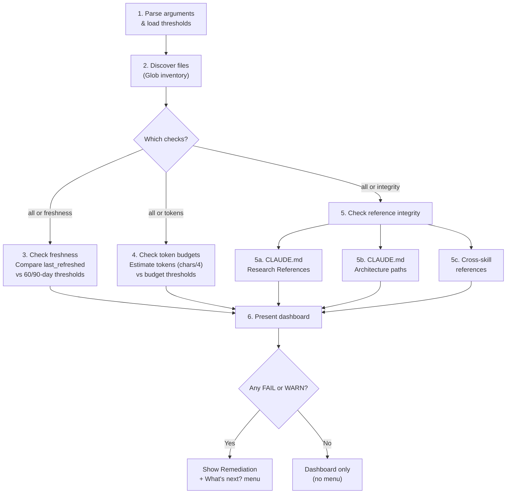

# check-repo-health

Verify reference file freshness, token budget compliance, and cross-skill reference integrity. Produces a consolidated health dashboard with pass/warn/fail status per check.

## Overview

| Property | Value |
|----------|-------|
| **Name** | check-repo-health |
| **Location** | `skills/check-repo-health/SKILL.md` |
| **Type** | Maintenance |
| **Allowed Tools** | Read, Glob |
| **Argument Hint** | `[all\|freshness\|tokens\|integrity]` |
| **Mode** | Standalone only |
| **Research Behavior** | None (no web research) |

## Purpose

The skill acts as a routine diagnostic for a skills repository. It answers three questions:

1. **Freshness** -- Are reference files and domain cache entries within their 90-day refresh cycle?
2. **Token Budgets** -- Do reference files stay within their allocated token budgets?
3. **Reference Integrity** -- Do all paths mentioned in CLAUDE.md and cross-skill references resolve to actual files?

The skill is strictly read-only and never modifies any file.

## Workflow



### Step 1: Parse arguments and load thresholds

Parse `$ARGUMENTS` for which checks to run. Valid values:

| Argument | Checks Run |
|----------|------------|
| `all` (default) | Freshness, Tokens, Integrity |
| `freshness` | Freshness only |
| `tokens` | Token budgets only |
| `integrity` | Reference integrity only |

Unrecognized arguments default to `all`.

Load configurable thresholds from `references/health-thresholds.md`. If the file cannot be read, fall back to built-in defaults and note the fallback in the dashboard header:

| Threshold | Default |
|-----------|---------|
| Freshness WARN | 60 days |
| Freshness FAIL | 90 days |
| Rubric token budget | 1000 |
| Baseline token budget | 2000 |
| Other reference budget | 500 |
| Budget WARN tier | 80% |
| Budget FAIL tier | 100% |

### Step 2: Discover files

Build a file inventory using Glob patterns:

| Pattern | Category |
|---------|----------|
| `.claude/skills/*/SKILL.md` | Repo-internal skill files |
| `.claude/skills/*/references/*.md` | Repo-internal reference files |
| `.claude/skills/*/references/domain-cache/*.md` | Repo-internal domain cache |
| `skills/*/SKILL.md` | Plugin skill files |
| `skills/*/references/*.md` | Plugin reference files |
| `skills/*/references/domain-cache/*.md` | Plugin domain cache |
| `research/**/*.md` | Research files |
| `CLAUDE.md` | Project instructions |

### Step 3: Check freshness

Applies when the argument is `all` or `freshness`.

For each reference file with a `last_refreshed` YAML frontmatter field:

1. Extract the `last_refreshed` date.
2. Compute days since refresh from today's date.
3. Classify the result:

| Status | Condition |
|--------|-----------|
| PASS | < 60 days |
| WARN | 60--89 days |
| FAIL | >= 90 days |

Domain cache entries use dates from `domain-cache/INDEX.md` (read once) rather than reading each cache file individually.

### Step 4: Check token budgets

Applies when the argument is `all` or `tokens`.

For each reference file:

1. Read content and estimate tokens as `character_count / 4` (approximate).
2. Apply the file-pattern-to-budget mapping from `health-thresholds.md`.
3. Classify the result:

| Status | Condition |
|--------|-----------|
| PASS | < 80% of budget |
| WARN | 80--100% of budget |
| FAIL | > 100% of budget |

The chars/4 approximation is always noted in the dashboard output.

### Step 5: Check reference integrity

Applies when the argument is `all` or `integrity`.

Three sub-checks run:

**5a. CLAUDE.md Research References** -- For each linked path in the `## Research References` section, verify the target file exists via Glob.

**5b. CLAUDE.md Architecture paths** -- For each file or directory path in the `## Architecture` section, verify it exists. If `## Architecture` is missing, try aliases in order: `## Structure`, `## Layout`, `## File Structure`. If none exist, record one FAIL row for the missing section.

**5c. Cross-skill references** -- For each SKILL.md, scan the body for paths referencing sibling skills or shared references (patterns: `../`, `references/`, sibling skill names). Verify each target exists via Glob.

All integrity checks are binary: PASS (file exists) or FAIL (file missing).

### Step 6: Present dashboard

Output a consolidated dashboard with tables for each check category:

```
## Repository Health Dashboard

**Date:** YYYY-MM-DD
**Checks run:** [list of checks]

### Freshness
| File | Last Refreshed | Days | Status |

### Token Budgets
| File | Estimated Tokens | Budget | Usage | Status |

Note: Token estimates use chars/4 approximation.

### Reference Integrity
| Source | Reference | Status |

---
**Summary:** X passed, Y warnings, Z failures
```

If any FAIL or WARN results exist, a **Remediation** section follows with targeted advice:

- Stale files: suggest `/refresh-engineering-baseline` or note the domain cache refresh schedule.
- Token budget violations: identify the file and the overage amount.
- Broken references: identify the source and the missing target path.

The "What's next?" menu appears only when issues are found:

1. Refresh stale baseline -- `/refresh-engineering-baseline`
2. Run a full review -- `/review-claude-config`
3. Done

If all checks pass, the dashboard is shown without a menu.

## Hard Rules

- **Read-only.** Never modify any file. This is a diagnostic skill only.
- **Always show all results.** Present the full dashboard even if everything passes.
- **Token estimation is approximate.** Always note that chars/4 is an approximation in output.
- **Graceful with missing files.** If a reference file cannot be read, report FAIL with a note rather than erroring out.

## Reference Files

| File | Purpose | Token Budget |
|------|---------|-------------|
| `references/health-thresholds.md` | Configurable thresholds for freshness, tokens, and integrity checks | <=500 |

## Interactions

| Direction | Target | Notes |
|-----------|--------|-------|
| Called by | User directly | Standalone invocation only |
| May suggest | `/refresh-engineering-baseline` | Via menu when stale files are found |
| May suggest | `/review-claude-config` | Via menu when any issues are found |
| Shares references with | None | -- |
