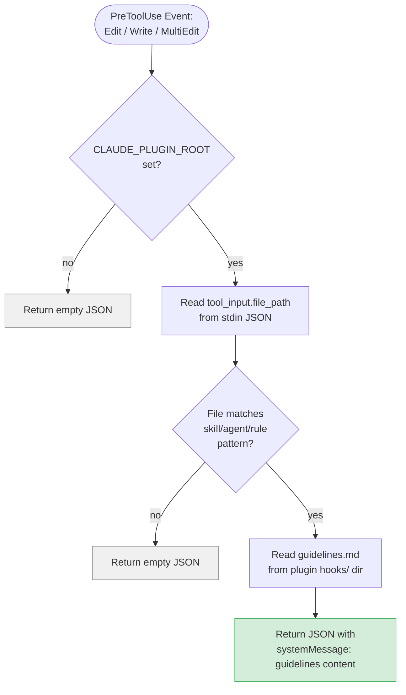

# Skill Quality Gate Hook

> Injects quality guidelines as a system message when editing skill, agent, or rule files.

**Hook Event:** PreToolUse
**Matcher:** `Edit|Write|MultiEdit`
**Script:** `hooks/skill_quality_gate.py`
**Timeout:** 10s
**Configuration:** `hooks/hooks.json`

## Overview

The skill quality gate is a PreToolUse hook that fires every time Claude attempts to edit, write, or multi-edit a file. It checks whether the target file matches known skill/agent/rule patterns and, if so, injects the contents of `hooks/guidelines.md` as a system message. This provides real-time quality guidance during editing without requiring the user to manually invoke a review skill.

The hook operates silently — if the file being edited is not a skill, agent, or rule, or if the plugin environment is not configured, it returns empty JSON and has no effect. All exceptions are caught and suppressed to prevent hook failures from blocking normal editing operations.

## Process Flow Diagram

## Process Steps

### Step 1: Environment Check

**Purpose:** Verify the hook is running within a plugin context.

**Process:**
- Read `CLAUDE_PLUGIN_ROOT` environment variable
- If not set (empty or missing), the hook is not running as part of an installed plugin — return `{}` immediately

### Step 2: Extract File Path

**Purpose:** Determine which file is being edited.

**Process:**
- Read JSON from stdin (provided by Claude Code hook framework)
- Extract `tool_input.file_path` from the input data

### Step 3: Pattern Matching

**Purpose:** Determine if the target file is a skill, agent, or rule.

**Process:**
- Match the file path against three glob patterns using Python's `fnmatch`:
  - `*/skills/*/SKILL.md` — matches any skill file
  - `*/.claude/agents/*.md` — matches any agent file
  - `*/.claude/rules/*.md` — matches any rule file
- If none match, return `{}` (no injection)

### Step 4: Guidelines Injection

**Purpose:** Provide real-time quality guidance to the editing model.

**Process:**
- Construct the path to `guidelines.md`: `{CLAUDE_PLUGIN_ROOT}/hooks/guidelines.md`
- Read the full file contents
- Return JSON: `{"systemMessage": "<guidelines content>"}`
- Claude Code injects this as a system message visible to the model during the edit operation

## Injected Content

The `hooks/guidelines.md` file contains a quality checklist covering 6 areas:

1. **Frontmatter** — Required fields (name, description), tool lists, rules have no YAML
2. **Evidence-first writing** — Explicit evidence over broad claims, re-checkable recommendations
3. **Clarity and completeness** — Numbered steps, explicit sequencing, measurable criteria, error handling
4. **Prompt and context engineering** — Concise main files, reference extraction, JIT loading, verification criteria, avoid time-sensitive wording
5. **Safety** — Minimal allowed-tools, confirmation gates, `disable-model-invocation: true` for side-effectful skills
6. **Rules-specific** — Precise scoped directives with strong action verbs

## Graceful Degradation

The hook is designed to never fail visibly:

- **No `CLAUDE_PLUGIN_ROOT`:** Returns `{}` silently
- **File doesn't match patterns:** Returns `{}` silently
- **`guidelines.md` missing or unreadable:** The outer `try/except` catches all exceptions and returns `{}`
- **Malformed stdin JSON:** Same exception handling applies
- **Always exits 0:** The `finally` block ensures `sys.exit(0)` regardless of outcome

## Related Components

- **Reads:** `hooks/guidelines.md` (quality checklist content)
- **Triggers for:** Any file matching `*/skills/*/SKILL.md`, `*/.claude/agents/*.md`, `*/.claude/rules/*.md`
- **Related skills:** All review-* and apply-* skills (this hook provides proactive guidance; review skills provide retrospective evaluation)
- **Configuration:** Registered in `hooks/hooks.json` under `PreToolUse` with matcher `Edit|Write|MultiEdit`
