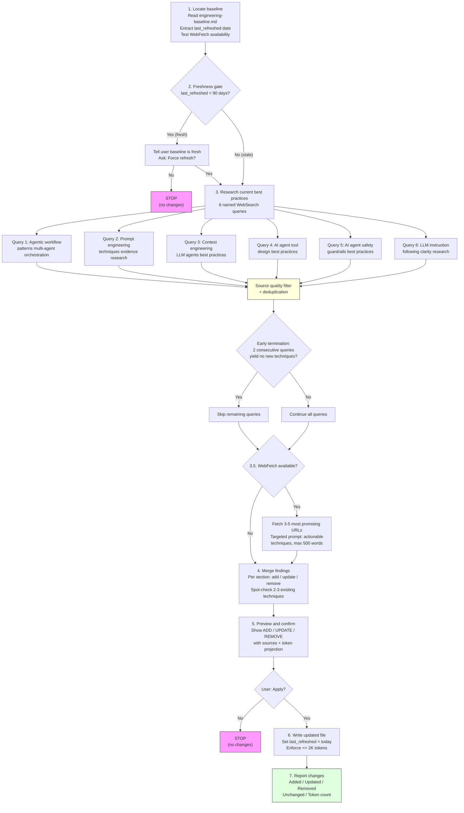

# refresh-engineering-baseline

Update the engineering baseline reference file with current web research. The most research-intensive skill in the repository, executing multiple web queries with strict source quality filtering.

## Overview

| Property | Value |
|----------|-------|
| **Name** | refresh-engineering-baseline |
| **Location** | `.claude/skills/refresh-engineering-baseline/SKILL.md` |
| **Type** | Maintenance |
| **Allowed Tools** | WebSearch, WebFetch, Read, Write |
| **disable-model-invocation** | true |
| **Mode** | Standalone only |
| **Research Behavior** | Most research-intensive (see [Research Behavior](#research-behavior)) |

## Purpose

The engineering baseline (`skills/review-claude-config/references/engineering-baseline.md`) is a shared reference consumed by all review skills. It encodes current best practices for prompt engineering, context engineering, and tool design as concrete, evidence-backed techniques. Over time, the field evolves and the baseline becomes stale. This skill refreshes it by conducting structured web research, merging new findings with existing content, and enforcing the 2K token budget.

The skill is the only writer of the engineering baseline. All other skills treat the baseline as read-only at review time. The 90-day refresh cycle is enforced by a freshness gate: if the baseline was refreshed recently, the skill asks before proceeding, preventing unnecessary churn.

## Workflow



## Process Steps

### Step 1: Locate baseline

Read `skills/review-claude-config/references/engineering-baseline.md`. Extract the `last_refreshed` date from YAML frontmatter. Test whether WebFetch is available (it is optional -- the skill degrades gracefully to WebSearch-only when WebFetch cannot be used).

### Step 2: Freshness gate

Compare `last_refreshed` against the current date:

| Condition | Action |
|-----------|--------|
| >= 90 days old (stale) | Proceed to research |
| < 90 days old (fresh) | Tell the user the baseline is still fresh, ask "Force refresh? (yes/no)" |

If the user declines the force refresh, the skill stops without changes.

### Step 3: Research current best practices

Execute 6 named WebSearch queries, each appending the current year:

| # | Query |
|---|-------|
| 1 | "agentic workflow patterns multi-agent orchestration [year]" |
| 2 | "prompt engineering techniques evidence research [year]" |
| 3 | "context engineering LLM agents best practices [year]" |
| 4 | "AI agent tool design best practices [year]" |
| 5 | "AI agent safety guardrails best practices [year]" |
| 6 | "LLM instruction following clarity research [year]" |

**Early termination:** If 2 consecutive queries yield no new techniques, skip the remaining queries.

**Deduplication:** Techniques found across multiple queries are merged, keeping the strongest evidence source.

**Source quality criteria (ALL must be met):**

1. **Credible source** -- Official vendor docs, peer-reviewed research, or documented production systems.
2. **Actionable** -- Specific implementable technique, not a general principle.
3. **Cross-validated** -- Confirmed by 2+ independent sources, OR a primary vendor source with concrete evidence.

**Discard:** Marketing material, opinion without evidence, tutorials without primary sources, anything older than 18 months.

**Failure handling:**

| Condition | Action |
|-----------|--------|
| WebSearch unavailable | STOP immediately |
| < 4 of 6 queries produce useful results | WARN the user, continue with available data |
| 0 of 6 queries produce useful results | STOP (no data to merge) |

### Step 3.5: Full-content retrieval (if WebFetch available)

If WebFetch is available, identify the 3--5 most promising URLs from all search results. Fetch each with a targeted extraction prompt:

> "Extract actionable prompt engineering, context engineering, tool design, safety, and instruction clarity techniques with evidence. Max 500 words."

This step is skipped entirely when WebFetch is not available. The skill proceeds directly to merge with WebSearch results only.

### Step 4: Merge findings

For each section of the baseline (Prompt Engineering, Context Engineering, Tool Design):

0. **Route** findings to sections: safety/guardrail techniques (least-privilege, confirmation gates, stop conditions) to Context Engineering; instruction clarity techniques (constraint limits, deterministic conditionals) to Prompt Engineering; agentic workflow techniques to the best-fit section.
1. **Add** new techniques not present in the current baseline.
2. **Update** existing techniques where newer evidence contradicts or supplements what is recorded.
3. **Spot-check** 2--3 existing techniques per section against search results to verify they remain current.
4. **Remove** techniques only if evidence shows they are superseded or debunked.
5. **Preserve format** for every technique: technique name, description, evidence source, check question.

### Step 5: Preview and confirm

Present a summary of all proposed changes:

```
## Proposed Changes

| Action  | Technique                  | Source                        |
|---------|----------------------------|-------------------------------|
| ADD     | New technique name         | vendor-docs.example.com       |
| UPDATE  | Existing technique name    | research-paper.example.com    |
| REMOVE  | Outdated technique name    | Superseded by X (source)      |

**Projected token count:** NNNN / 2000
```

Ask the user: "Apply these changes? (yes/no)". If no, stop without changes.

### Step 6: Write updated file

Apply all confirmed changes to `skills/review-claude-config/references/engineering-baseline.md`:

- Set `last_refreshed` in YAML frontmatter to today's date.
- Enforce the 2K token budget. If the updated file would exceed 2000 tokens, remove techniques with the weakest evidence until the file fits.
- Preserve the existing file structure and format exactly.

### Step 7: Report changes

Output a summary table:

```
## Refresh Summary

| Metric      | Count |
|-------------|-------|
| Added       | N     |
| Updated     | N     |
| Removed     | N     |
| Unchanged   | N     |
| Token count | NNNN / 2000 |
```

## Research Behavior

This is the most research-intensive skill in the repository. Its research pipeline includes:

- **6 named WebSearch queries** with early termination (stop if 2 consecutive queries yield nothing new)
- **3--5 WebFetch requests** for full article content extraction (when WebFetch is available)
- **Strict source quality criteria** requiring credible, actionable, and cross-validated sources
- **Deduplication** across all query results
- **18-month recency filter** discarding outdated material
- **Graceful degradation** to WebSearch-only when WebFetch is unavailable

## Hard Rules

1. **Preserve file structure and format exactly.** The baseline file format must not change.
2. **Never exceed 2K tokens.** Remove lowest-evidence techniques if the budget would be exceeded.
3. **Every technique must cite an evidence source.** No technique is added without a verifiable reference.
4. **Do not remove unless evidence shows wrong or superseded.** Existing techniques are presumed valid unless contradicted.
5. **If WebSearch fails or the user declines, leave the file unchanged.** The skill has multiple explicit stop points that guarantee no unconfirmed writes.

## Reference Files

This skill does not have reference files of its own. It writes to the shared engineering baseline:

| File | Relationship | Token Budget |
|------|-------------|-------------|
| `skills/review-claude-config/references/engineering-baseline.md` | **Write target** (the file this skill updates) | <=2000 |

## Interactions

| Direction | Target | Notes |
|-----------|--------|-------|
| Called by | User directly | Standalone invocation only |
| Suggested by | `/check-repo-health` | When freshness check finds the baseline stale |
| Suggested by | `hooks/session_check.py` | SessionStart hook warns if baseline is >90 days old |
| Calls | Nothing | -- |
| Modifies | `skills/review-claude-config/references/engineering-baseline.md` | Shared reference consumed by all review skills |
