# Review Agent

> Evaluate a single Claude Code agent (.md file) across 7 dimensions with agent-specific checks: model selection appropriateness, description/example block activation precision, and trigger pattern coverage. Produces a quality certificate with concrete optimization recommendations.

**Command:** `/review-agent <path-to-agent.md>`
**Location:** `skills/review-agent/SKILL.md`
**Type:** Review
**Allowed Tools:** Read, Write, Glob, WebSearch, WebFetch
**Mode Support:** Standalone + Orchestrated (via `/review-claude-config`)

## Overview

The review-agent skill performs a structured quality evaluation of a single Claude Code agent file. Agents differ from skills in that they are single-file primitives (no `references/` directory) and rely on frontmatter fields (`model`, `tools`, `description`) plus optional `<example>` blocks for activation. This means the evaluation criteria shift compared to review-skill: Context Engineering evaluates activation precision rather than progressive disclosure, Completeness checks `<example>` block coverage, and Metadata validates model selection appropriateness.

The skill operates in two modes. In standalone mode (user-invoked), it runs the full workflow: tool availability checks, reference loading, evaluation, output, and report persistence. In orchestrated mode (delegated by `/review-claude-config`), it receives pre-checked tool flags and cached domain content via an `---orchestration---` block, skips setup, and returns only the structured certificate with no user interaction.

Scoring follows the shared rubric across all 7 dimensions (Clarity, Completeness, Prompt Engineering, Context Engineering, Goal Alignment, Safety, Metadata) with agent-specific criteria layered on top. Safety and Metadata weights shift dynamically based on whether the agent has write-capable tools. The output is a graded certificate with evidence-backed recommendations, each including a concrete rewrite.

## Process Flow Diagram

```mermaid
flowchart TD
    A["Start: /review-agent path"] --> B{"Orchestration<br/>block present?"}
    B -- Yes --> C["Orchestrated mode:<br/>use provided flags + cache"]
    B -- No --> D["Standalone mode"]

    D --> E["Step 0: Tool checks<br/>(WebSearch, WebFetch)"]
    E --> F["Step 1: Load references<br/>- scoring-rubric.md (shared)<br/>- engineering-baseline.md (shared)<br/>- agent-evaluation-guide.md (own)"]
    F --> G{"References<br/>found?"}
    G -- No --> H["Abort: required reference<br/>not found"]
    G -- Yes --> I["Step A: Goal inference +<br/>domain research"]

    C --> I

    I --> J{"WebSearch<br/>available?"}
    J -- Yes --> K["1-2 WebSearch queries<br/>for domain best practices"]
    J -- No --> L["Use model knowledge only<br/>(mark: no web verification)"]
    K --> M{"WebFetch<br/>available?"}
    L --> M
    M -- Yes --> N["1-2 WebFetch for<br/>relevant URLs"]
    M -- No --> O["Skip WebFetch"]
    N --> P["Synthesize domain<br/>best practices"]
    O --> P

    P --> Q["Step B: Score 7 dimensions"]

    Q --> R{{"Agent-specific checks"}}
    R --> S["Model validation:<br/>haiku / sonnet / opus<br/>vs task complexity"]
    R --> T["Example block check:<br/><example> coverage for<br/>trigger patterns"]
    R --> U["Activation precision:<br/>description specificity<br/>vs false-positive triggers"]

    S --> V["Apply rubric +<br/>agent evaluation guide"]
    T --> V
    U --> V

    V --> W{"Has Write/Bash/Edit<br/>in tools?"}
    W -- Yes --> X["Safety=15%, Metadata=5%"]
    W -- No --> Y["Safety=10%, Metadata=10%"]
    X --> Z["Calculate weighted score<br/>A=95 B=85 C=75 D=65 F=50"]
    Y --> Z

    Z --> AA["Phase 3: Generate certificate<br/>+ strengths + recommendations"]

    AA --> AB{"Orchestrated<br/>mode?"}
    AB -- Yes --> AC["Return structured<br/>certificate only"]
    AB -- No --> AD["Phase 4: Present to user"]
    AD --> AE{"User confirms<br/>save?"}
    AE -- Yes --> AF["Write report to<br/>.claude/reviews/<br/>YYYY-MM-DDTHHMMSS-review-agent.md"]
    AE -- No --> AG["Skip persistence"]
    AF --> AH["Show What's Next menu:<br/>1. Apply findings<br/>2. Review another agent<br/>3. Done"]
    AG --> AH
```

## Process Steps

### Mode Detection

Before any work begins, the skill checks whether the prompt contains an `---orchestration---` metadata block. If present, the skill enters orchestrated mode: it skips tool checks and reference loading, uses the provided `websearch_available`, `webfetch_available` flags and any `domain_cache` content, and returns only the structured certificate with no user interaction. If absent, it runs the full standalone workflow described below.

### Phase 1 -- Setup (standalone mode only)

**Step 0: Tool availability checks.** The skill attempts a trivial WebSearch query (e.g., "Claude Code documentation"). If it fails, `websearch_available` is set to false and Goal Alignment will be scored from model knowledge only, marked `[no web verification]`. It then attempts a trivial WebFetch (e.g., fetch `https://docs.anthropic.com`). If that fails, `webfetch_available` is set to false.

**Step 1: Load references.** The skill locates the `review-claude-config` sibling skill directory and reads two shared reference files: `references/scoring-rubric.md` (the grading criteria) and `references/engineering-baseline.md` (prompt, context, and tool design techniques). If either file is not found, the skill aborts with an error. It then reads its own type-specific guide: `references/agent-evaluation-guide.md`, which contains the agent-specific evaluation criteria used in Phase 2.

### Phase 2 -- Evaluation

**Step A: Goal inference and domain research.** The skill reads the agent file and infers its primary goal and domain in one sentence. If WebSearch is available, it performs 1-2 search queries for domain best practices. If WebFetch is available, it fetches 1-2 of the most relevant URLs with a focused extraction prompt (domain best practices, benchmarks, configuration patterns, max 500 words). If neither is available, domain research falls back to model knowledge only. The result is a synthesis of what a high-quality agent in this domain should include.

**Step B: Scoring and recommendations.** Each of the 7 dimensions is scored using the shared rubric as the primary basis, with agent-specific criteria layered on top:

| Dimension | Weight | Agent-Specific Criteria |
|-----------|--------|------------------------|
| Clarity | 15% | Instructions unambiguous within single-file constraint; section structure for longer agents |
| Completeness | 15% | `<example>` blocks for trigger coverage; no examples + ambiguous description results in C or below |
| Prompt Engineering | 15% | Role priming, structured output, constraints, few-shot via `<example>` blocks |
| Context Engineering | 15% | Activation precision of description and examples (NOT progressive disclosure); generic description results in C or below |
| Goal Alignment | 20% | Domain knowledge depth, tool/structure fit for stated goal |
| Safety | 10% or 15% | Least-privilege tools, guardrails for destructive actions |
| Metadata | 10% or 5% | Model field appropriateness (haiku/sonnet/opus), tools match actual usage, description accuracy |

Safety and Metadata weights are dynamic: if the agent declares Write, Bash, or Edit in its tools, Safety increases to 15% and Metadata decreases to 5%. Otherwise, Safety is 10% and Metadata is 10%.

The overall grade is calculated by converting letter grades to numeric values (A=95, B=85, C=75, D=65, F=50), computing the weighted sum, and mapping back (>=90 is A, >=80 is B, >=70 is C, >=60 is D, <60 is F).

### Phase 3 -- Output

The skill produces the certificate in a fixed format: a Goal line, a graded table with all 7 dimensions plus the weighted overall, grading boundary examples (Clarity B vs C, Safety B vs C), a Strengths section, and a Recommendations section. Each High or Medium recommendation includes Evidence (quoted text with path), Why It Matters (referencing baseline techniques or domain practices), Validation (how to confirm on re-review), and Current/Recommended code blocks with concrete rewrites.

The output also includes a Reference File Recommendation section. Since agents are single-file and cannot have reference directories, this section notes whether the agent would benefit from extracted reference content and, if so, recommends converting to a skill format, explaining the tradeoff.

### Phase 4 -- Persistence (standalone mode only)

In standalone mode, after presenting the certificate, the skill asks the user to confirm saving. If confirmed, it writes a report file to `<target>/.claude/reviews/YYYY-MM-DDTHHMMSS-review-agent.md` with YAML frontmatter containing metadata (generator, date, target path, baseline version, per-dimension grades, overall score). The `name` field in the frontmatter is a display label; analytics track by `path` as the canonical identity.

The skill suggests committing with: `docs(reviews): add YYYY-MM-DDTHHMMSS review report`

Finally, it presents a What's Next menu offering three options: apply findings, review another agent, or stop. The menu uses plain text output (not `AskUserQuestion`) due to a known Claude Code bug with plugin skills.

## Key Differences from review-skill

The review-agent skill shares the same rubric, baseline, and overall certificate structure as review-skill, but differs in several important ways:

1. **Single-file constraint.** Agents have no `references/` directory. Context Engineering evaluates activation precision (how well the description and examples target the right requests) rather than progressive disclosure (how reference files manage context).

2. **Model selection validation.** Metadata scoring checks the `model` frontmatter field against task complexity: haiku for simple/fast tasks, sonnet as the default, opus for complex reasoning tasks.

3. **Example block importance.** `<example>` blocks are critical for Completeness scoring. An agent with no examples and an ambiguous description is capped at C for Completeness.

4. **Reference File Recommendation.** Instead of reviewing existing references, this section advises whether the agent should be converted to a skill to benefit from extracted reference content.

## Research Behavior

The skill performs 1-2 WebSearch queries plus 1-2 WebFetch requests for domain best practices during Step A. This research informs Goal Alignment scoring and enriches recommendations but does not alter the scoring criteria for other dimensions. If WebSearch is unavailable, Goal Alignment is scored from model knowledge only and marked accordingly. If WebFetch is unavailable, the skill degrades gracefully to WebSearch-only results.

## Reference Files

| File | Location | Purpose |
|------|----------|---------|
| `scoring-rubric.md` | `review-claude-config/references/` (shared) | Grading criteria for all 7 dimensions |
| `engineering-baseline.md` | `review-claude-config/references/` (shared) | Prompt, context, and tool design techniques |
| `agent-evaluation-guide.md` | `review-agent/references/` (own) | Agent-specific evaluation criteria: activation precision, model selection, example blocks |

## Interactions with Other Skills

- **Called by:** `/review-claude-config` delegates to this skill in orchestrated mode when it encounters agent files during a batch review.
- **Calls:** No other skills. Returns a structured certificate that the orchestrator consumes.
- **Shares references with:** `/review-claude-config` provides the shared `scoring-rubric.md` and `engineering-baseline.md`. The same files are used by `/review-skill` and `/review-rule`.

## Hard Rules

1. **Read-only on the analyzed agent.** Never modify the agent being reviewed. Write only to `.claude/reviews/`.
2. **Apply the rubric strictly.** Do not inflate grades. The rubric and evaluation guide are the authority.
3. **Every High or Medium recommendation must include evidence and a concrete rewrite.** Not just "improve X" -- quote the problematic text, explain why it matters, and provide the improved version.
4. **Present the full certificate before any follow-up actions.** No partial output or premature persistence.

## Output Format

The skill produces a structured certificate followed by recommendations. The certificate table includes all 7 dimensions with grades, weights, and one-line justifications, plus a weighted overall row. Recommendations are ordered by impact (High, Medium, Low) and each includes Evidence, Why It Matters, Validation criteria, and Current/Recommended code blocks.

In standalone mode, the output concludes with a YAML-frontmatter report file and a What's Next menu. In orchestrated mode, only the structured certificate is returned with no user-facing chrome.
