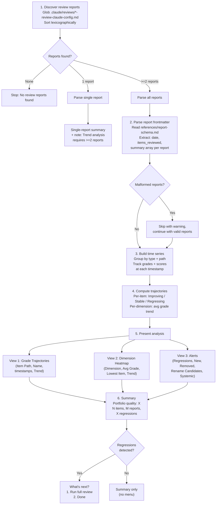

# review-analytics

Parse accumulated review reports, compute grade trajectories per item and dimension, and detect regressions. Pure read-only analytics over the review history.

## Overview

| Property | Value |
|----------|-------|
| **Name** | review-analytics |
| **Location** | `skills/review-analytics/SKILL.md` |
| **Type** | Maintenance (Analytics) |
| **Allowed Tools** | Read, Glob |
| **Argument Hint** | `[folder]` |
| **Mode** | Standalone only |
| **Research Behavior** | None (no web research) |

## Purpose

The skill answers three questions about a portfolio's quality evolution over time:

1. **Trajectory** -- Is each reviewed item improving, stable, or regressing across review cycles?
2. **Dimension trends** -- Which scoring dimensions are strengthening or weakening across the portfolio?
3. **Alerts** -- Are there regressions, disappearances, or systemic issues that need attention?

It operates exclusively on the structured YAML frontmatter of review reports already written to `.claude/reviews/`. The skill never modifies any file.

## Workflow



### Step 1: Discover review reports

Glob for `<target>/.claude/reviews/*-review-claude-config.md` where `<target>` is the folder argument (defaults to the current project root). Sort results by filename -- because filenames are ISO-timestamped (`YYYY-MM-DDTHHMMSS-...`), lexicographic order equals chronological order.

| Condition | Behavior |
|-----------|----------|
| No reports found | Output a message and stop |
| Exactly 1 report | Parse and present a single-report summary; append note: "Trend analysis requires >=2 reports." |
| 2+ reports | Continue to full workflow |

### Step 2: Parse report frontmatter

Read `references/report-schema.md` to confirm the expected YAML frontmatter structure. For each discovered report, extract:

| Field | Description |
|-------|-------------|
| `date` | Report timestamp |
| `items_reviewed` | Count of items in the report |
| `summary` | Array of item entries |

Each entry in the `summary` array contains:

| Field | Description |
|-------|-------------|
| `name` | Display label for the item |
| `type` | Item type (skill, agent, rule) |
| `path` | Canonical tracking key (absolute or repo-relative path) |
| `overall` | Overall letter grade (A-F) |
| `score` | Numeric weighted score |
| 7 dimension grades | One grade per dimension (Clarity, Completeness, etc.) |

Malformed reports (missing required fields, unparseable YAML) are skipped with a warning message listing the filename and the reason for skipping. Processing continues with the remaining valid reports.

### Step 3: Build time series

Group items by their canonical identity: `type + path`. For each unique identity, record the overall grade, numeric score, and all 7 dimension grades at each report timestamp.

Handle lifecycle events:

| Event | Detection | Label |
|-------|-----------|-------|
| **New item** | Path appears for the first time in a report | "New" |
| **Removed item** | Path present in older report(s), absent in the latest report | "Removed" |
| **Rename/move candidate** | A path disappears and a new path appears for the same type in the same report transition | Flagged for review |

### Step 4: Compute trajectories

**Per-item overall trajectory** -- Compare the earliest and latest data points for each item:

| Trajectory | Condition |
|------------|-----------|
| Improving | Latest grade > earliest grade, OR numeric score increased by >=5 |
| Stable | Grade unchanged and score variation < 5 across all data points |
| Regressing | Latest grade < previous grade, OR numeric score decreased by >=5 |

Grade comparison order: A > B > C > D > F.

Examples:
- B(82) -> B(86) -> B(81) = **Stable** (grade unchanged, score range < 5)
- B(82) -> A(90) -> B(85) = **Regressing** (latest grade B < previous grade A)

**Per-dimension trends** -- For each of the 7 dimensions, compute the average grade across all items in the latest report and compare against the average in the earliest report. Flag dimensions where the average has dropped by one or more letter grades.

### Step 5: Present analysis

Output three views in sequence:

**View 1: Grade Trajectories**

```
### Grade Trajectories

| Item Path | Display Name | [Timestamp 1] | [Timestamp 2] | ... | Trend |
|-----------|-------------|----------------|----------------|-----|-------|
| path/to/skill | My Skill | B (82) | B (86) | ... | Stable |
```

One column per report timestamp. Each cell shows `Grade (Score)`. The Trend column shows Improving, Stable, or Regressing.

**View 2: Dimension Heatmap**

```
### Dimension Heatmap

| Dimension | Avg Grade (Latest) | Lowest Item | Trend vs First |
|-----------|--------------------|-------------|----------------|
| Clarity | A | path/to/weakest | Improving |
```

One row per dimension. Shows the average grade across all items in the latest report, identifies the item with the lowest grade in that dimension, and compares against the earliest report's average.

**View 3: Alerts**

```
### Alerts

**Regressions:** [list of items with Regressing trajectory]
**New Items:** [list of items first seen in the latest report]
**Removed Items:** [list of items absent from the latest report]
**Rename/Move Candidates:** [list of suspected renames with old and new paths]
**Systemic Issues:** [dimensions declining across multiple items]
```

Each section is omitted if empty. If all sections are empty, output "No alerts."

### Step 6: Summary

Output a single summary line:

```
Portfolio quality: [Improving|Stable|Declining] -- N items, M reports, X regressions.
```

The overall portfolio status is determined by:

| Status | Condition |
|--------|-----------|
| Improving | More items improving than regressing, no systemic dimension declines |
| Stable | No regressions, no systemic declines |
| Declining | Any regressions or systemic dimension declines present |

The "What's next?" menu appears only when regressions are detected:

1. Run full review -- `/review-claude-config`
2. Done

If no regressions exist, the summary is presented without a menu.

## Hard Rules

- **Read-only.** Never modify any file. This is a pure analytics skill.
- **Handle malformed reports gracefully.** Skip with a warning; never abort the entire analysis because of one bad report.
- **Present all data before conclusions.** The three views come before the summary line.
- **Timestamp sorting is lexicographic.** Rely on the ISO-formatted filenames for chronological ordering.
- **Track by path first.** The canonical identity for any item is `type + path`. The `name` field is a display label only.
- **Grade comparison order.** A > B > C > D > F. No plus/minus modifiers.

## Reference Files

| File | Purpose |
|------|---------|
| `references/report-schema.md` (own) | Expected YAML frontmatter structure for review reports |

## Interactions

| Direction | Target | Notes |
|-----------|--------|-------|
| Called by | User directly | Standalone invocation |
| Called by | `/review-claude-config` menu | Suggested as a follow-up option |
| May suggest | `/review-claude-config` | Via menu when regressions are detected |
| Shares references with | None | -- |
