# Review Claude Config

> Batch-audit all Claude Code skills, agents, and rules in a project's `.claude/` directory. Discovers items via a sub-agent, performs domain-cache-mediated web research, dispatches type-specific analysis agents in batches of 8, and produces per-item quality certificates with an aggregated summary table, cross-cutting observations, and delta comparison against prior reviews.

**Command:** `/review-claude-config [folder]`
**Location:** `skills/review-claude-config/SKILL.md`
**Type:** Review (Batch Orchestrator)
**Allowed Tools:** Agent, Read, Write, Glob, WebSearch, WebFetch
**Mode Support:** Standalone only (this skill IS the batch orchestrator; it is never delegated to)

## Overview

The review-claude-config skill is the top-level orchestrator for project-wide quality audits. Given a target folder (defaulting to the current working directory), it discovers every skill, agent, and rule under `.claude/`, loads shared references (scoring rubric and engineering baseline), performs domain cache lookups and web research coordination, dispatches per-item analysis to specialized review sub-agents (review-skill, review-agent, review-rule), and assembles the results into a comprehensive report.

The orchestrator coordinates domain research across items to avoid redundant web queries. It maintains a persistent domain cache (`references/domain-cache/`) where web research results are stored per domain key. For each discovered item, the orchestrator determines whether cached research exists, whether it is fresh or stale, and assigns exactly one "researcher" agent per domain that needs refreshing. All other agents sharing that domain receive the cached content as consumers.

Analysis agents are dispatched in parallel batches of 8, with type-specific shared prefixes constructed to be byte-identical across items of the same type, maximizing KV-cache efficiency. Each agent returns a structured quality certificate or an error block. After all agents complete, the orchestrator presents results, persists updated domain cache entries, writes a timestamped review report with YAML frontmatter, and optionally compares grades against a prior review.

The skill is strictly read-only on all analyzed files. It writes only to `.claude/reviews/` (report) and its own `references/domain-cache/` (research cache).

## Process Flow Diagram

```mermaid
flowchart TD
    Start["Start: /review-claude-config [folder]"] --> ArgCheck{"Folder argument<br/>provided?"}
    ArgCheck -- Yes --> ValidateDir{"Folder exists with<br/>.claude/ directory?"}
    ArgCheck -- No --> UseCwd["Use current working directory"]
    UseCwd --> ValidateDir
    ValidateDir -- No --> ErrStop["Report: no .claude/ found. STOP"]
    ValidateDir -- Yes --> Phase1

    subgraph Phase1["Phase 1 -- Setup and Discovery"]
        direction TB
        ToolCheck["Step 0: Tool Availability Checks"]
        ToolCheck --> WSTest["Try WebSearch:<br/>'Claude Code documentation'"]
        WSTest --> WSResult{"WebSearch<br/>succeeded?"}
        WSResult -- Yes --> WSOn["websearch_available = true"]
        WSResult -- No --> WSOff["websearch_available = false"]
        WSOn --> WFTest
        WSOff --> WFTest
        WFTest["Try WebFetch:<br/>https://docs.anthropic.com"]
        WFTest --> WFResult{"WebFetch<br/>succeeded?"}
        WFResult -- Yes --> WFOn["webfetch_available = true"]
        WFResult -- No --> WFOff["webfetch_available = false"]
        WFOn --> Parallel
        WFOff --> Parallel

        Parallel["Steps 1-2: Launch in parallel"]

        subgraph ParallelSteps["Parallel Execution"]
            direction LR
            subgraph Step1["Step 1: Load References"]
                ReadRubric["Read scoring-rubric.md"]
                ReadRubric --> ReadBaseline["Read engineering-baseline.md"]
                ReadBaseline --> FreshnessCheck{"Baseline<br/>last_refreshed<br/>> 3 months?"}
                FreshnessCheck -- Yes --> Warn["Warn: consider<br/>/refresh-engineering-baseline"]
                FreshnessCheck -- No --> RefsReady["References loaded"]
                Warn --> RefsReady
            end
            subgraph Step2["Step 2: Discovery Agent"]
                LaunchAgent["Launch Agent<br/>(Glob, Read)"]
                LaunchAgent --> GlobSkills["Glob: .claude/skills/*/SKILL.md<br/>+ monorepo variants"]
                GlobSkills --> GlobAgents["Glob: .claude/agents/*.md<br/>+ monorepo variants"]
                GlobAgents --> GlobRules["Glob: .claude/rules/*.md<br/>+ monorepo variants"]
                GlobRules --> Filter["Exclude: node_modules,<br/>.git, vendor, dist,<br/>build, .claude/reviews"]
                Filter --> ReadAll["Read full content<br/>of each discovered file"]
                ReadAll --> Classify["Classify each as<br/>Skill / Agent / Rule"]
                Classify --> ReturnList["Return: path, type,<br/>content per item"]
            end
        end

        Parallel --> ParallelSteps
        ParallelSteps --> FoundItems{"Any items<br/>discovered?"}
        FoundItems -- No --> NoItems["Report: nothing found. STOP"]
        FoundItems -- Yes --> Phase2Start["Proceed to Phase 2"]
    end

    Phase1 --> Phase2

    subgraph Phase2["Phase 2 -- Per-Item Analysis"]
        direction TB

        subgraph CacheLookup["Step 0: Domain Cache Lookup"]
            direction TB
            LoadIndex["Load references/domain-cache/INDEX.md"]
            LoadIndex --> IndexExists{"INDEX.md<br/>exists?"}
            IndexExists -- No --> AllMiss["All items: cache status = MISS"]
            IndexExists -- Yes --> MatchKeys["For each item:<br/>match to existing domain key<br/>or generate new key"]
            MatchKeys --> NormPass["Normalization pass:<br/>collapse near-duplicates<br/>(e.g., react-test -> react-testing)"]
            NormPass --> ClassifyCache["For each domain key:"]

            ClassifyCache --> CacheDecision{"Check<br/>last_refreshed<br/>in INDEX"}

            CacheDecision --> Cached["CACHED<br/>(< 90 days)"]
            CacheDecision --> Stale["STALE<br/>(>= 90 days)"]
            CacheDecision --> Miss["MISS<br/>(new key)"]
            CacheDecision --> NoDomain["NONE<br/>(no domain inferred)"]

            Cached --> ReadCacheFile["Read domain-cache/<br/>{key}.md"]
            ReadCacheFile --> CacheFileExists{"File<br/>exists?"}
            CacheFileExists -- Yes --> ConsumerRole["Role: consumer<br/>(use cached content)"]
            CacheFileExists -- No --> FallbackMiss["Treat as MISS"]

            Stale --> ReadStaleFile["Read domain-cache/<br/>{key}.md"]
            ReadStaleFile --> AssignResearcher1["First agent for this domain:<br/>Role = researcher<br/>(verify/update via WebSearch)"]
            AssignResearcher1 --> OtherConsumers1["Other agents same domain:<br/>Role = consumer<br/>(use cached as-is)"]

            Miss --> AssignResearcher2["First agent for this domain:<br/>Role = researcher<br/>(1-2 WebSearch queries)"]
            FallbackMiss --> AssignResearcher2
            AssignResearcher2 --> OtherConsumers2["Other agents same domain:<br/>Role = consumer<br/>(model knowledge only)"]
            AllMiss --> AssignResearcher2

            NoDomain --> NoCache["No cache interaction;<br/>WebSearch as normal"]
        end

        CacheLookup --> LoadSpecs

        subgraph LoadSpecs["Step 1: Load Specialized Skill Content"]
            direction TB
            GlobReviewSkills["Glob for sibling review skills:<br/>review-skill/SKILL.md<br/>review-agent/SKILL.md<br/>review-rule/SKILL.md"]
            GlobReviewSkills --> ReadTypeContent["Read SKILL.md + evaluation guide<br/>for each type with discovered items"]
            ReadTypeContent --> SkipUnused["Skip types with<br/>no discovered items"]
        end

        LoadSpecs --> Dispatch

        subgraph Dispatch["Step 2: Dispatch Analysis Agents"]
            direction TB
            GroupByType["Group items by type:<br/>Skill / Agent / Rule"]
            GroupByType --> BuildPrefix["Build type-specific shared prefix<br/>(byte-identical for KV-cache):<br/>[Specialized SKILL.md]<br/>[Scoring Rubric]<br/>[Engineering Baseline]<br/>[Evaluation Guide]"]
            BuildPrefix --> BuildSuffix["Build per-item suffix:<br/>---orchestration---<br/>mode, websearch/webfetch flags,<br/>domain_cache content/status/role<br/>+ Item path and full content"]

            BuildSuffix --> Batch1["Batch 1: agents 1-8<br/>(parallel dispatch)"]
            Batch1 --> Collect1["Collect certificates<br/>or ERROR blocks"]
            Collect1 --> MoreBatches{"More items<br/>remaining?"}
            MoreBatches -- Yes --> BatchN["Batch N: next 8 agents<br/>(parallel dispatch)"]
            BatchN --> CollectN["Collect certificates<br/>or ERROR blocks"]
            CollectN --> MoreBatches
            MoreBatches -- No --> CollectUpdates["Collect 'Domain Cache Update'<br/>sections from researcher agents"]
        end
    end

    Phase2 --> Phase3

    subgraph Phase3["Phase 3 -- Presentation"]
        direction TB
        PresentReports["Present each item's report<br/>(Goal + Certificate + Strengths<br/>+ Recommendations)"]
        PresentReports --> SummaryTable["Summary Table:<br/>Item | Type | Overall | Clarity |<br/>Completeness | PE | CE |<br/>Goal | Safety | Meta"]
        SummaryTable --> CrossCutting["Cross-Cutting Observations:<br/>- Common anti-patterns<br/>- Consistent strengths<br/>- Systemic recommendations<br/>- Missing CLAUDE.md guidance<br/>(with concrete example paths)"]
    end

    Phase3 --> Phase35

    subgraph Phase35["Phase 3.5 -- Domain Cache Persistence"]
        direction TB
        WebAvail{"websearch_available<br/>OR webfetch_available?"}
        WebAvail -- No --> SkipCache["Skip cache persistence entirely<br/>(never write from model knowledge alone)"]
        WebAvail -- Yes --> AnyUpdates{"Any researcher agents<br/>returned Domain Cache<br/>Update sections?"}
        AnyUpdates -- No --> SkipCache2["No cache updates needed"]
        AnyUpdates -- Yes --> ConfirmCache["Confirm: 'Update domain cache<br/>for: [list of keys]?'"]
        ConfirmCache --> UserDeclines{"User<br/>confirms?"}
        UserDeclines -- No --> SkipCache3["Skip cache writes"]
        UserDeclines -- Yes --> CreateDir["Create references/domain-cache/<br/>if not exists"]
        CreateDir --> WriteCacheFiles["Write/update each<br/>{domain-key}.md:<br/>YAML frontmatter<br/>(domain, last_refreshed,<br/>queries, sources)<br/>+ body <= 500 tokens"]
        WriteCacheFiles --> UpdateIndex["Update INDEX.md:<br/>add/update rows for<br/>each written domain key"]
        UpdateIndex --> ReportCache["Report: 'Updated domain cache:<br/>[list of keys written]'"]
    end

    Phase35 --> Phase4

    subgraph Phase4["Phase 4 -- Report Persistence"]
        direction TB
        ConfirmReport["Confirm: 'Save report to<br/>.claude/reviews/YYYY-MM-DDTHHMMSS<br/>-review-claude-config.md?'"]
        ConfirmReport --> UserSaves{"User<br/>confirms?"}
        UserSaves -- No --> ShowPath["Display the report path<br/>that would have been used"]
        UserSaves -- Yes --> AssembleReport["Step 1: Assemble report<br/>with YAML frontmatter:<br/>generated_by, schema_version,<br/>date, target, baseline_version,<br/>items_reviewed, summary array<br/>(name, type, path, overall,<br/>score, 7 dimension grades)"]
        AssembleReport --> LargeCheck{"More than<br/>20 items?"}
        LargeCheck -- Yes --> CondenseAB["Full reports only for C or below;<br/>A/B items get one-line summary<br/>(all still in frontmatter + table)"]
        LargeCheck -- No --> FullReports["Include all full per-item<br/>reports in body"]
        CondenseAB --> WriteReport
        FullReports --> WriteReport
        WriteReport["Step 2: Write report to<br/>.claude/reviews/YYYY-MM-DDTHHMMSS<br/>-review-claude-config.md"]
        WriteReport --> DeltaCheck{"Prior review<br/>report exists?"}
        DeltaCheck -- Yes --> ReadPrior["Step 3: Read prior report<br/>frontmatter summary"]
        ReadPrior --> CompareGrades["Compare each item's<br/>current vs. prior grades"]
        CompareGrades --> AppendDelta["Append 'Delta from Prior Review'<br/>table (only changed grades)"]
        AppendDelta --> SuggestCommit
        DeltaCheck -- No --> SuggestCommit
        SuggestCommit["Step 4: Suggest commit:<br/>docs(reviews): add<br/>YYYY-MM-DDTHHMMSS review report"]
        ShowPath --> Menu
        SuggestCommit --> Menu
        Menu["Step 5: What's next?<br/>1. Apply review findings<br/>2. View grade analytics<br/>3. Done"]
    end
```



## Process Steps

### Phase 1 -- Setup and Discovery

**Step 0: Tool availability checks.** The orchestrator performs two probe calls to determine which web tools are available for the session. First, it attempts a trivial WebSearch query ("Claude Code documentation"). If the call fails or the tool is unavailable, `websearch_available` is set to false. Then it attempts a trivial WebFetch against `https://docs.anthropic.com`. If that fails, `webfetch_available` is set to false. These flags propagate to all analysis agents via the orchestration metadata block and determine whether domain cache persistence is allowed (Phase 3.5 requires at least one web tool).

**Step 1: Load references (parallel).** The orchestrator reads two shared reference files from its own `references/` directory:

- `references/scoring-rubric.md` -- the 7-dimension A-F grading rubric (Clarity 15%, Completeness 15%, Prompt Engineering 15%, Context Engineering 15%, Goal Alignment 20%, Safety 10-15%, Metadata 5-10%)
- `references/engineering-baseline.md` -- prompt, context, and tool design techniques compiled from current research

It checks the `last_refreshed` date in the baseline frontmatter. If the date is older than 3 months, a warning is shown: "Baseline was last refreshed on [date]. Consider running `/refresh-engineering-baseline` for current best practices."

**Step 2: Discovery agent (parallel with Step 1).** The orchestrator launches a sub-agent with Glob and Read as its only tools. This agent searches for all Claude Code primitives using these glob patterns:

- `<folder>/.claude/skills/*/SKILL.md`
- `<folder>/.claude/agents/*.md`
- `<folder>/.claude/rules/*.md`
- `<folder>/**/.claude/skills/*/SKILL.md` (monorepo support)
- `<folder>/**/.claude/agents/*.md` (monorepo support)
- `<folder>/**/.claude/rules/*.md` (monorepo support)

Paths containing `node_modules`, `.git`, `vendor`, `dist`, `build`, or `.claude/reviews` are excluded. For each discovered file, the agent reads its full content, classifies it as Skill, Agent, or Rule, and returns the path, type, and content. It also notes (without analyzing) the existence of `CLAUDE.md` and `.claude/settings.json`.

If no items are discovered, the orchestrator reports that and stops.

### Phase 2 -- Per-Item Analysis

**Step 0: Domain cache lookup.** Before dispatching analysis agents, the orchestrator performs a domain cache coordination pass:

1. **Load the cache index.** Read `references/domain-cache/INDEX.md`. If missing or empty, all items receive MISS status and proceed with normal WebSearch behavior.

2. **Match or infer domain keys.** For each discovered item, the orchestrator determines which domain key best matches, using the full INDEX.md table as context. Existing keys are strongly preferred over generating new ones to maximize cache reuse (e.g., use existing `kubernetes` rather than generating `k8s`). When ambiguous between existing entries, the more specific key wins (e.g., `argocd` over `gitops`). Items with no clear domain (e.g., generic "code-review" or "commit" skills) skip cache lookup entirely. A normalization pass after all items collapses near-duplicates.

3. **Classify cache status per domain key:**
   - **CACHED** -- `last_refreshed` is less than 90 days old. Read the cached file content. Agent role: consumer (use cached content, skip WebSearch; 1 supplemental query if insufficient).
   - **STALE** -- `last_refreshed` is 90 days or older. Read the cached file as a starting point. Agent role: the first agent for this domain becomes the researcher (1 WebSearch to verify/update; returns a "Domain Cache Update" section). Other agents sharing the domain are consumers (use stale content as-is).
   - **MISS** -- New key not in the index, or index says CACHED but the file is physically missing. Agent role: the first agent becomes the researcher (1-2 WebSearch queries; returns a "Domain Cache Update" section). Other agents are consumers (model knowledge only).
   - **NONE** -- No domain inferred for this item. Agent proceeds with standard WebSearch behavior without cache interaction.

4. **Assign exactly one researcher per domain.** For STALE and MISS domains shared by multiple items, only the first agent assigned to that domain performs web research. All other agents for the same domain receive the instruction: "Another agent is researching this domain -- use cached content or model knowledge, do not WebSearch for domain research."

**Step 1: Load specialized skill content.** The orchestrator locates the three specialized review skills in sibling directories (`review-skill/`, `review-agent/`, `review-rule/`). For each type that has discovered items, it reads the SKILL.md and the corresponding evaluation guide:

- Skills: `review-skill/SKILL.md` + `review-skill/references/skill-evaluation-guide.md`
- Agents: `review-agent/SKILL.md` + `review-agent/references/agent-evaluation-guide.md`
- Rules: `review-rule/SKILL.md` + `review-rule/references/rule-evaluation-guide.md`

Types with no discovered items are skipped entirely.

**Step 2: Dispatch analysis agents.** Items are grouped by type. For each type group, the orchestrator constructs two parts:

*Type-specific shared prefix (byte-identical across items of the same type):*
This prefix contains the specialized SKILL.md instructions, the scoring rubric, the engineering baseline, and the type-specific evaluation guide. Byte-identical construction ensures that all agents of the same type share a common KV-cache prefix, reducing compute costs when items are processed in sequence.

*Per-item suffix (unique to each item):*
An `---orchestration---` block containing: `mode: orchestrated`, `websearch_available` and `webfetch_available` flags, and the `domain_cache` section with cached content, cache status (CACHED/STALE/MISS/NONE), and the agent's role (researcher or consumer). Below the orchestration block, the full file content of the item under review.

*Dispatch rules:*
- Each agent receives WebSearch, WebFetch (if available), and Read as allowed tools. No Write, Edit, or Bash.
- Agents are dispatched in parallel batches of 8. Each batch's results are presented before starting the next.
- Each agent returns a structured certificate (Goal + scoring table + strengths + recommendations) or an `## ERROR` block on failure.
- On agent error: the orchestrator logs the failure and continues with remaining items. Errors are never silently skipped.

**Domain cache update collection.** After all agents complete, the orchestrator collects "Domain Cache Update" sections from researcher agents that had STALE or MISS cache status. These are held for Phase 3.5.

### Phase 3 -- Presentation

The orchestrator presents each item's report to the user in sequence (Goal, Certificate, Strengths, Recommendations). After all individual reports, it adds:

**Summary Table.** A single table with columns: Item, Type, Overall, Clarity, Completeness, PE, CE, Goal, Safety, Meta. Rules show dashes for inapplicable dimensions (PE, CE, Safety, Metadata).

**Cross-Cutting Observations.** Patterns identified across all items:
- Common anti-patterns (e.g., consistent tool bloat, missing output formats)
- Consistent strengths (e.g., good safety practices across all items)
- Systemic recommendations (e.g., "all agents would benefit from reference files")
- Missing CLAUDE.md guidance that would benefit all items
- Each observation cites one concrete example path for verifiability

### Phase 3.5 -- Domain Cache Persistence

After presenting all reports, the orchestrator persists updated domain research to the cache. This phase is skipped entirely if both `websearch_available` and `webfetch_available` are false, enforcing the hard rule that cache entries must come from web research only.

1. The orchestrator confirms before writing: "Update domain cache with research for: [list of domain keys]?"
2. If the user declines, cache writes are skipped.
3. For each domain cache update collected from researcher agents:
   - The file `references/domain-cache/{domain-key}.md` is created or updated with YAML frontmatter (`domain`, `last_refreshed`, `queries`, `sources`) and a body of bullet-point content capped at 500 tokens.
4. `references/domain-cache/INDEX.md` is updated with new or modified rows.
5. The orchestrator reports: "Updated domain cache: [list of keys written/updated]."

### Phase 4 -- Report Persistence

**Step 1: Assemble report.** The orchestrator constructs a Markdown file with YAML frontmatter containing: `generated_by: review-claude-config`, `schema_version`, `date`, `target` (absolute path), `baseline_version`, `items_reviewed`, and a `summary` array. Each summary entry includes `name` (display label), `type`, `path` (canonical identity for analytics), `overall` grade, numeric `score`, and all 7 dimension grades (null for inapplicable dimensions on Rules).

The body contains all per-item reports, the Summary Table, and Cross-Cutting Observations. Every High or Medium recommendation preserves the evidence-first format: heading with Impact and Category, Evidence, Why it matters, Validation, and Current/Recommended blocks when a concrete rewrite is feasible.

**Large codebase handling.** When more than 20 items are reviewed, full per-item reports are included only for items scoring C or below. A/B items receive a one-line summary row. All items are still analyzed and appear in the frontmatter summary and Summary Table (the "analyze every discovered item" hard rule is preserved -- only report verbosity is reduced).

**Step 2: Write report.** The report is written to `<target>/.claude/reviews/YYYY-MM-DDTHHMMSS-review-claude-config.md`. The directory is created if it does not exist.

**Step 3: Delta comparison.** If a prior review report exists in `<target>/.claude/reviews/`, the orchestrator reads its frontmatter `summary` block, compares each item's current grades against prior grades, and appends a "Delta from Prior Review" section showing only rows where grades changed.

**Step 4: Confirm.** The orchestrator displays the report file path and suggests committing with: `docs(reviews): add YYYY-MM-DDTHHMMSS review report`. The timestamp links the docs commit to subsequent fix commits (`fix(<scope>): address findings from YYYY-MM-DDTHHMMSS review`).

**Step 5: What's next?** The orchestrator ends with a numbered menu:
1. Apply review findings (invokes `/apply-review-findings` with the report path)
2. View grade analytics (invokes `/review-analytics`)
3. Done

## Research Behavior

The orchestrator uses a domain cache system to coordinate web research across all analysis agents, avoiding redundant queries and persisting results for future reviews.

**Per-item research flow:**

1. **Cache lookup.** The orchestrator matches each item to a domain key and checks the cache index. Items receive one of four statuses: CACHED (fresh content available), STALE (outdated content available), MISS (no content), or NONE (no domain inferred).

2. **Researcher/consumer assignment.** For each STALE or MISS domain, exactly one agent is designated as the researcher. That agent performs 1-2 WebSearch queries for its domain. If WebFetch is available, it fetches full article content from the most relevant URLs. All other agents sharing the same domain are consumers that use the cached or model-only content.

3. **Cache update collection.** Researcher agents include a "Domain Cache Update" section in their output containing the queries used, sources found, and summarized domain knowledge.

4. **Persistence.** After all agents complete and results are presented, the orchestrator writes updated cache entries back to `references/domain-cache/` (with user confirmation). Each entry has YAML frontmatter with provenance metadata and a body capped at 500 tokens.

5. **Graceful degradation.** If WebSearch is unavailable, Goal Alignment is scored from model knowledge only and marked `[no web verification]`. If both web tools are unavailable, cache persistence is skipped entirely.

## Reference Files

| File | Location | Purpose |
|------|----------|---------|
| `references/scoring-rubric.md` | Own skill directory (shared) | 7-dimension A-F grading rubric with conditional weighting |
| `references/engineering-baseline.md` | Own skill directory (shared) | Prompt, context, and tool design techniques from research |
| `references/domain-cache/INDEX.md` | Own skill directory | Domain cache directory mapping keys to refresh dates and descriptions |
| `references/domain-cache/{key}.md` | Own skill directory | Cached domain research per domain (YAML frontmatter + bullet content) |
| `review-skill/SKILL.md` | Sibling skill directory | Specialized evaluation instructions for skills |
| `review-skill/references/skill-evaluation-guide.md` | Sibling skill directory | Type-specific evaluation criteria for skills |
| `review-agent/SKILL.md` | Sibling skill directory | Specialized evaluation instructions for agents |
| `review-agent/references/agent-evaluation-guide.md` | Sibling skill directory | Type-specific evaluation criteria for agents |
| `review-rule/SKILL.md` | Sibling skill directory | Specialized evaluation instructions for rules |
| `review-rule/references/rule-evaluation-guide.md` | Sibling skill directory | Type-specific evaluation criteria for rules |

## Interactions with Other Skills

- **Called by:** User directly. This skill is the top-level batch orchestrator and is never delegated to by another skill.
- **Calls/Delegates to:** `review-skill`, `review-agent`, `review-rule` -- their SKILL.md content is loaded and injected into analysis agents as the type-specific shared prefix. The specialized skills run in orchestrated mode, skipping their own setup and persistence phases.
- **Shares references with:** All `review-*` skills share the scoring rubric and engineering baseline from this skill's `references/` directory.
- **Follow-up skills:** `/apply-review-findings` (orchestrates fixes from the review report), `/review-analytics` (grade trajectory and regression detection). Both are offered via the "What's next?" menu.

## Hard Rules

1. **Read-only on analyzed files.** Never modify any discovered skill, agent, or rule file. Write only to `.claude/reviews/` (report) and own `references/domain-cache/` (cache entries).
2. **Domain cache from web research only.** Never write cache entries based on model knowledge alone. If both WebSearch and WebFetch are unavailable, skip cache persistence entirely.
3. **Analyze every discovered item.** Skip none. Large codebase handling reduces report verbosity for high-scoring items but does not skip analysis.
4. **Apply the rubric strictly.** Do not inflate grades. The scoring rubric is the primary basis for all dimension grades.
5. **Every High or Medium recommendation must include evidence and a concrete rewrite.** A recommendation that says only "improve X" without quoting problematic text and providing a replacement is insufficient.
6. **Present all reports before asking about follow-up actions.** The user sees the complete evaluation before being offered persistence, cache updates, or next steps.
7. **Error handling.** If an analysis agent fails, log the failure with partial results and continue with remaining items. Never silently skip.

## Output Format

The skill produces output in the following structure:

**Per-item reports** (repeated for each discovered item):

```
### Goal
[One sentence describing what this item aims to achieve]

### Certificate

| Dimension | Grade | Weight | Justification |
|-----------|-------|--------|---------------|
| Clarity | [A-F] | 15% | [One line] |
| Completeness | [A-F] | 15% | [One line] |
| Prompt Engineering | [A-F] | 15% | [One line] |
| Context Engineering | [A-F] | 15% | [One line] |
| Goal Alignment | [A-F] | 20% | [One line] |
| Safety | [A-F] | [10/15%] | [One line] |
| Metadata | [A-F] | [10/5%] | [One line] |
| **Overall** | **[A-F]** | **100%** | **Weighted: XX.X** |

### Strengths
- [strength 1]
- [strength 2]

### Recommendations
#### 1. [Title] (Impact: [High/Medium/Low], Category: [...])
**Evidence:** [quoted text or section reference]
**Why it matters:** [explanation]
**Validation:** [how to verify]
**Current:** [existing text]
**Recommended:** [concrete rewrite]
```

**Summary Table** (after all per-item reports):

```
## Summary

| Item | Type | Overall | Clarity | Completeness | PE | CE | Goal | Safety | Meta |
|------|------|---------|---------|--------------|----|----|------|--------|------|
| ... | Skill | ... | ... | ... | ... | ... | ... | ... | ... |
| ... | Rule | ... | ... | ... | -- | -- | ... | -- | -- |
```

**Cross-Cutting Observations** (after summary table):

```
## Cross-Cutting Observations
- [pattern with concrete example path]
- [pattern with concrete example path]
```

**Delta from Prior Review** (appended if prior report exists):

```
## Delta from Prior Review ([prior report date])

| Item | Dimension | Previous | Current | Change |
|------|-----------|----------|---------|--------|
| [only rows where grades changed] |
```

On agent failure, the affected item appears as:

```
## ERROR
{item_path}: {reason}
```
