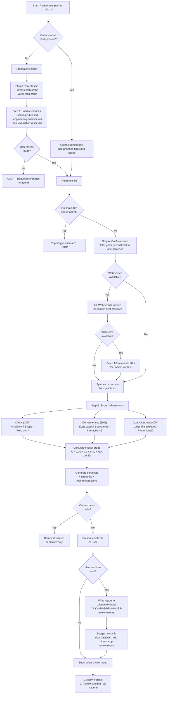

# Review Rule

> Evaluate a single Claude Code rule (.md file) across 3 dimensions: Clarity (30%), Completeness (30%), and Goal Alignment (40%). Rules are directives without tools or frontmatter, so Prompt Engineering, Context Engineering, Safety, and Metadata do not apply. Produces a quality certificate with concrete optimization recommendations.

**Command:** `/review-rule <path-to-rule.md>`
**Location:** `skills/review-rule/SKILL.md`
**Type:** Review
**Allowed Tools:** Read, Write, Glob, WebSearch, WebFetch
**Mode Support:** Standalone + Orchestrated

## Overview

The review-rule skill evaluates a single Claude Code rule file against 3 quality dimensions. Rules are plain Markdown directives -- they have no tools, no standardized frontmatter, and no prompt/context engineering concerns. This makes them fundamentally different from skills and agents, which are scored across 7 dimensions.

Because rules are simple constraint directives, the skill uses a reduced evaluation framework:

- **Clarity (30%):** Can the rule be interpreted unambiguously by any model?
- **Completeness (30%):** Does the rule cover edge cases, exceptions, and boundaries?
- **Goal Alignment (40%):** Does the rule achieve its stated constraint effectively?

The remaining 4 dimensions from the full rubric (Prompt Engineering, Context Engineering, Safety, Metadata) are skipped entirely -- they do not apply to rules. The 3 active dimensions are renormalized to total 100%.

The skill runs in two modes. In standalone mode, it performs the full workflow including tool checks, reference loading, web research, evaluation, report persistence, and a follow-up menu. In orchestrated mode (when called by `/review-claude-config`), it skips setup and persistence, returning only the structured certificate.

## Process Flow Diagram



## Process Steps

### Phase 1 -- Setup (standalone mode only)

**Step 0: Tool availability checks.** The skill attempts a trivial WebSearch query (e.g., "Claude Code documentation") to determine whether web search is available. If it fails, the skill sets `websearch_available = false` and later marks Goal Alignment scores with `[no web verification]`. It then attempts a trivial WebFetch call to determine whether URL fetching is available. These checks are skipped in orchestrated mode, which receives availability flags from the orchestrator.

**Step 1: Load references.** The skill locates the `review-claude-config` sibling skill directory and reads two shared reference files: `references/scoring-rubric.md` (grading criteria) and `references/engineering-baseline.md` (engineering techniques). It uses Glob to find these files if the path is not immediately known. If either file is missing, the skill aborts with an error. It also reads its own type-specific reference file: `references/rule-evaluation-guide.md`.

**Validation: Type check.** After reading the target file, the skill checks whether it looks like a skill (has SKILL.md frontmatter with a `name` field) or an agent (has `model`/`tools` frontmatter). If either is detected, the skill reports the type mismatch and stops. Rules are plain Markdown files with no standardized frontmatter, typically found in `.claude/rules/`.

### Phase 2 -- Evaluation

**Step A: Goal inference and domain research.** The skill reads the rule file and infers its primary constraint or goal in one sentence. It then performs domain research to understand what a high-quality rule in this domain should enforce. If WebSearch is available, it issues 1-2 queries for domain best practices related to the rule's constraint. If WebFetch is also available, it fetches 1-2 of the most relevant URLs with a prompt to extract domain best practices, benchmarks, and configuration patterns (max 500 words). If neither tool is available, the skill relies on model knowledge only.

**Step B: Scoring and recommendations.** The skill scores the rule using the rubric as the primary basis, applying only 3 dimensions renormalized to 100%:

| Dimension | Weight | Evaluation Criteria |
|-----------|--------|---------------------|
| **Clarity** | 30% | Is the rule unambiguous? Could two models interpret it differently? Are terms precise? Is scope explicit? |
| **Completeness** | 30% | Are edge cases and exceptions addressed? Are scope boundaries defined? Are rule interactions considered? Does the rule assume external tools that may not be available? |
| **Goal Alignment** | 40% | Does the rule achieve its stated constraint? Is it proportional to the problem? Does it prevent the specific behavior it targets? Are there obvious workarounds? Does domain knowledge reveal missing constraints? |

The skill never scores rules on Prompt Engineering, Context Engineering, Safety, or Metadata. These dimensions do not apply because rules have no tools, no frontmatter, and are directives rather than prompts.

Grades are calculated as: A=95, B=85, C=75, D=65, F=50. The overall weighted score is Clarity x 0.30 + Completeness x 0.30 + Goal Alignment x 0.40. The score maps back to a letter grade: 90 or above is A, 80 or above is B, 70 or above is C, 60 or above is D, below 60 is F.

### Phase 3 -- Output

The skill generates a certificate with the following sections:

- **Goal:** One sentence describing what the rule aims to enforce.
- **Certificate table:** 3 dimensions plus an overall row, each with grade, weight, and one-line justification. The overall row shows the weighted numeric score and resulting grade.
- **Grading boundary examples:** Concrete examples distinguishing adjacent grades (e.g., Clarity B vs C, Completeness B vs C) to calibrate expectations.
- **Strengths:** 2-3 bullet points highlighting what the rule does well.
- **Recommendations:** Ordered by impact (High, Medium, Low). Each recommendation includes a title, impact level, category (Scope, Clarity, Completeness, Alignment, or Exceptions), evidence quoting the exact problematic text, explanation of why it matters with domain best practice references, validation criteria for re-review, and a current/recommended rewrite pair.

### Phase 4 -- Report Persistence (standalone mode only)

In orchestrated mode, the skill returns only the structured certificate and skips this phase entirely.

In standalone mode, the skill presents the certificate to the user, then asks for confirmation before saving. The report is written to `<target>/.claude/reviews/YYYY-MM-DDTHHMMSS-review-rule.md` with YAML frontmatter containing metadata. The frontmatter includes `prompt_engineering: null`, `context_engineering: null`, `safety: null`, and `metadata: null` to signal that these dimensions were intentionally skipped.

After saving, the skill suggests a commit message: `docs(reviews): add YYYY-MM-DDTHHMMSS review report`.

The skill then presents a follow-up menu:

```
What's next?
1. Apply findings -> /apply-rule-review-findings <report-path>
2. Review another rule
3. Done
```

## Research Behavior

The skill performs 1-2 WebSearch queries to gather domain best practices related to the rule's constraint. If WebFetch is available, it fetches 1-2 of the most relevant URLs for deeper context. Research is focused on understanding what a high-quality rule in the target domain should enforce, which informs the Goal Alignment score. When neither WebSearch nor WebFetch is available, the skill degrades gracefully to model knowledge only and annotates the Goal Alignment score accordingly.

## Reference Files

| File | Purpose |
|------|---------|
| `references/rule-evaluation-guide.md` (own) | Rule-specific evaluation criteria across 5 areas |
| `review-claude-config/references/scoring-rubric.md` (shared) | Grading rubric with A-F criteria |
| `review-claude-config/references/engineering-baseline.md` (shared) | Engineering techniques baseline |

## Interactions with Other Skills

- **Called by:** `/review-claude-config` in orchestrated mode (delegated as part of a batch audit).
- **Calls:** Nothing. This skill does not invoke other skills.
- **Shares references with:** All review skills share `scoring-rubric.md` and `engineering-baseline.md` from the `review-claude-config` skill directory.
- **Related apply skill:** `/apply-rule-review-findings` consumes the review report produced by this skill and applies the recommendations.

## Hard Rules

1. **Read-only on the analyzed rule.** Never modify the rule being reviewed. Write only to `.claude/reviews/`.
2. **Apply the rubric strictly.** Do not inflate grades.
3. **Every High or Medium recommendation must include evidence and a concrete rewrite** -- not just "improve X."
4. **Present the full certificate before any follow-up actions.**
5. **Use only 3 dimensions.** Never score rules on Prompt Engineering, Context Engineering, Safety, or Metadata.

## Output Format

The skill produces a quality certificate in this structure:

```
### Goal
[One sentence describing what this rule aims to enforce]

### Certificate

| Dimension | Grade | Weight | Justification |
|-----------|-------|--------|---------------|
| Clarity | [A-F] | 30% | [One line] |
| Completeness | [A-F] | 30% | [One line] |
| Goal Alignment | [A-F] | 40% | [One line] |
| **Overall** | **[A-F]** | **100%** | **Weighted: XX.X** |

### Strengths
- [strength 1]
- [strength 2]

### Recommendations

#### 1. [Title] (Impact: [High/Medium/Low], Category: [Scope|Clarity|Completeness|Alignment|Exceptions])
**Evidence:** [Quote from the rule]
**Why it matters:** [Explanation with domain best practice reference]
**Validation:** [How to confirm the fix]
**Current:** [existing text]
**Recommended:** [improved text]
```

In orchestrated mode, only the structured certificate is returned (no report persistence, no menu). In standalone mode, the certificate is followed by the report save prompt and the follow-up menu.
