# Review Skill

> Evaluate a single Claude Code skill (SKILL.md) across 7 dimensions: Clarity, Completeness, Prompt Engineering, Context Engineering, Goal Alignment, Safety, and Metadata. Produces a quality certificate with concrete optimization recommendations.

**Command:** `/review-skill <path-to-SKILL.md>`
**Location:** `skills/review-skill/SKILL.md`
**Type:** Review
**Allowed Tools:** Read, Write, Glob, WebSearch, WebFetch
**Mode Support:** Standalone + Orchestrated (via `/review-claude-config`)

## Overview

The review-skill skill performs an evidence-based quality evaluation of a single Claude Code skill file. It reads the target SKILL.md, conducts optional domain research via web tools, scores the skill against a shared rubric across 7 weighted dimensions, and produces a certificate with grades, strengths, and prioritized recommendations. Every High or Medium recommendation includes quoted evidence from the skill and a concrete rewrite.

The skill supports two modes. In standalone mode (invoked directly by the user), it runs the full workflow: tool availability checks, reference loading, evaluation, certificate presentation, report persistence, and a "What's next?" menu. In orchestrated mode (delegated by `/review-claude-config`), it skips setup and persistence, uses pre-provided flags and domain cache, and returns only the structured certificate for the orchestrator to aggregate.

The skill is strictly read-only on the analyzed file. It writes only to `.claude/reviews/` when persisting a report in standalone mode.

## Process Flow Diagram

```mermaid
flowchart TD
    Start["Start: /review-skill &lt;path&gt;"] --> Validate{"File exists with<br/>YAML frontmatter<br/>+ name field?"}
    Validate -- No --> ErrStop["Report error. STOP"]
    Validate -- Yes --> ModeCheck{"Prompt contains<br/>---orchestration---<br/>block?"}

    %% ── Orchestrated path ──
    ModeCheck -- Yes --> OrcParse["Parse orchestration block:<br/>websearch_available, webfetch_available,<br/>domain_cache"]
    OrcParse --> EvalA

    %% ── Standalone path ──
    ModeCheck -- No --> WS["Step 0a: Try WebSearch<br/>'Claude Code documentation'"]
    WS --> WSResult{"WebSearch<br/>succeeded?"}
    WSResult -- Yes --> WSOn["websearch_available = true"]
    WSResult -- No --> WSOff["websearch_available = false"]
    WSOn --> WF
    WSOff --> WF
    WF["Step 0b: Try WebFetch<br/>https://docs.anthropic.com"]
    WF --> WFResult{"WebFetch<br/>succeeded?"}
    WFResult -- Yes --> WFOn["webfetch_available = true"]
    WFResult -- No --> WFOff["webfetch_available = false"]
    WFOn --> LoadRefs
    WFOff --> LoadRefs

    LoadRefs["Step 1: Glob for sibling<br/>review-claude-config skill"]
    LoadRefs --> ReadRefs["Read shared references:<br/>- scoring-rubric.md<br/>- engineering-baseline.md"]
    ReadRefs --> RefsOK{"Both files<br/>found?"}
    RefsOK -- No --> ErrAbort["Abort: Required reference<br/>not found. STOP"]
    RefsOK -- Yes --> ReadGuide["Read own reference:<br/>skill-evaluation-guide.md"]
    ReadGuide --> EvalA

    %% ── Shared evaluation path ──
    EvalA["Step A: Read skill.<br/>Infer goal in one sentence."]
    EvalA --> Research{"websearch_available?"}
    Research -- Yes --> WSearch["1-2 WebSearch queries<br/>for domain best practices"]
    Research -- No --> ModelOnly["Use model knowledge only<br/>(mark: no web verification)"]
    WSearch --> FetchCheck{"webfetch_available?"}
    FetchCheck -- Yes --> WFetch["WebFetch 1-2 URLs:<br/>'Extract domain best practices...<br/>Max 500 words'"]
    FetchCheck -- No --> Synth
    WFetch --> Synth
    ModelOnly --> Synth
    Synth["Synthesize domain expectations:<br/>What should a high-quality<br/>skill in this domain include?"]

    Synth --> Score["Step B: Score 7 dimensions<br/>using rubric as PRIMARY basis"]
    Score --> Weights{"Skill has Write,<br/>Bash, or Edit<br/>in allowed-tools?"}
    Weights -- Yes --> HiSafety["Safety = 15%<br/>Metadata = 5%"]
    Weights -- No --> LoSafety["Safety = 10%<br/>Metadata = 10%"]
    HiSafety --> Calc
    LoSafety --> Calc
    Calc["Calculate weighted score:<br/>A=95 B=85 C=75 D=65 F=50<br/>Map: >=90 A, >=80 B,<br/>>=70 C, >=60 D, <60 F"]
    Calc --> Cert["Phase 3: Assemble certificate<br/>(Goal, Table, Boundary Examples,<br/>Strengths, Recommendations)"]

    %% ── Post-evaluation branching ──
    Cert --> ModeCheck2{"Orchestrated<br/>mode?"}
    ModeCheck2 -- Yes --> ReturnCert["Return structured<br/>certificate only. DONE"]
    ModeCheck2 -- No --> Present["Present certificate to user"]
    Present --> ConfirmSave{"User confirms<br/>save to .claude/reviews/?"}
    ConfirmSave -- No --> Menu
    ConfirmSave -- Yes --> WriteReport["Write report with<br/>YAML frontmatter to<br/>.claude/reviews/<br/>YYYY-MM-DDTHHMMSS-review-skill.md"]
    WriteReport --> SuggestCommit["Suggest commit:<br/>docs(reviews): add<br/>YYYY-MM-DDTHHMMSS review report"]
    SuggestCommit --> Menu

    Menu["What's next?<br/>1. Apply findings<br/>2. Review another skill<br/>3. Done"]
```



## Process Steps

### Mode Detection

The skill checks whether the prompt contains an `---orchestration---` metadata block. This block is injected by `/review-claude-config` when it delegates evaluation of individual items. It includes pre-computed tool availability flags (`websearch_available`, `webfetch_available`) and an optional `domain_cache` with previously fetched research content. If the block is present, the skill enters orchestrated mode and skips Phase 1 and Phase 4 entirely. If absent, it enters standalone mode and runs the full workflow.

### Phase 1 -- Setup (standalone mode only)

**Step 0: Tool availability checks.** The skill attempts a trivial WebSearch query ("Claude Code documentation") to test whether WebSearch is available. If the call fails, `websearch_available` is set to false. It then attempts a trivial WebFetch against `https://docs.anthropic.com`. If that fails, `webfetch_available` is set to false. These flags determine how domain research is conducted in Phase 2. When WebSearch is unavailable, Goal Alignment is scored from model knowledge only and marked `[no web verification]` in the certificate.

**Step 1: Load references.** The skill locates the `review-claude-config` sibling skill directory using Glob (`**/review-claude-config/references/scoring-rubric.md`). It reads two shared reference files:

- `references/scoring-rubric.md` -- the 7-dimension grading criteria used as the primary scoring basis
- `references/engineering-baseline.md` -- prompt, context, and tool design techniques from current research

If either shared reference is not found, the skill aborts with an error: "Required reference not found. Ensure review-claude-config is installed as a sibling skill."

The skill also reads its own type-specific reference:

- `references/skill-evaluation-guide.md` -- criteria specific to skill evaluation (as opposed to agent or rule evaluation)

### Phase 2 -- Evaluation

**Step A: Goal inference and domain research.** The skill reads the target SKILL.md and infers its primary goal and domain in one sentence. It then conducts domain research based on tool availability flags:

- If `websearch_available`: 1-2 WebSearch queries targeting domain best practices relevant to the skill's purpose.
- If `webfetch_available`: fetch 1-2 of the most relevant URLs from search results using the prompt "Extract domain best practices, benchmarks, and configuration patterns relevant to [domain]. Max 500 words."
- If neither tool is available: rely on model knowledge only.

In orchestrated mode, the skill uses whatever `domain_cache` content was provided in the orchestration block and respects the provided flags. The result is a synthesized set of expectations for what a high-quality skill in this domain should include.

**Step B: Scoring and recommendations.** The skill scores all 7 dimensions using the rubric as the primary basis. The skill evaluation guide provides type-specific criteria. Domain research informs Goal Alignment and enriches recommendations but does not alter scoring criteria for other dimensions.

Skill-specific evaluation criteria:

| Dimension | Weight | What to Check |
|-----------|--------|---------------|
| **Clarity** | 15% | Workflow step sequencing, conditional branch criteria, parallel/sequential markers |
| **Completeness** | 15% | Argument handling, output format, error handling, stop conditions |
| **Prompt Engineering** | 15% | Structured output templates, role priming, few-shot examples, constraints, CoT guidance |
| **Context Engineering** | 15% | Progressive disclosure, reference file separation, tool set curation, subagent isolation, output conciseness |
| **Goal Alignment** | 20% | Domain knowledge, tool/structure fit, workflow coverage of domain requirements |
| **Safety** | 10% or 15% | Least-privilege tools, confirmation gates (if Write/Bash/Edit), stop conditions, `disable-model-invocation` |
| **Metadata** | 10% or 5% | Frontmatter completeness, description accuracy, tool list matches actual usage, `argument-hint` present |

The Safety and Metadata weights shift based on the skill's tool list. If the skill includes Write, Bash, or Edit in its `allowed-tools`, Safety receives 15% weight and Metadata receives 5%. Otherwise, Safety is 10% and Metadata is 10%. All other dimension weights remain constant.

Grade calculation:

1. Convert letter grades to numeric values: A=95, B=85, C=75, D=65, F=50.
2. Compute weighted score: sum of (grade value x weight) for all 7 dimensions.
3. Map back to letter grade: >=90 is A, >=80 is B, >=70 is C, >=60 is D, <60 is F.
4. The Overall row shows: "Weighted: XX.X" with the resulting grade.

### Phase 3 -- Output

The skill assembles a certificate in a fixed format containing these sections in order:

1. **Goal** -- one sentence describing what the skill aims to achieve.
2. **Certificate** -- a table with all 7 dimensions plus the Overall row, each showing Grade, Weight, and a one-line Justification.
3. **Grading Boundary Examples** -- two concrete comparisons (Clarity B vs C, Safety B vs C) showing what differentiates adjacent grades. If WebSearch was unavailable, a note is appended.
4. **Strengths** -- 2-3 bullet points highlighting what the skill does well.
5. **Recommendations** -- ordered by impact (High, Medium, Low), each containing:
   - **Evidence:** exact quoted text or section reference from the skill
   - **Why it matters:** what to change and why, referencing baseline techniques or domain best practices
   - **Validation:** how to confirm the fix on re-review
   - **Current:** the existing text from the skill
   - **Recommended:** a concrete rewrite

   An optional Reference File Recommendation may follow if bundled reference files would improve the skill's context engineering.

### Phase 4 -- Report Persistence (standalone mode only)

In orchestrated mode, the skill returns the structured certificate and stops. The orchestrator handles aggregation and persistence.

In standalone mode:

1. The full certificate is presented to the user.
2. The skill asks for confirmation before writing: "Save review report to `<target>/.claude/reviews/YYYY-MM-DDTHHMMSS-review-skill.md`?"
3. If confirmed, the skill writes the report with YAML frontmatter containing a `summary` array. The frontmatter includes `generated_by`, `schema_version`, `date`, `target` (absolute path), `baseline_version`, `items_reviewed`, and per-item grades. The `path` field in the summary is the canonical identity for analytics tracking.
4. The skill suggests a commit message: `docs(reviews): add YYYY-MM-DDTHHMMSS review report`.
5. The skill ends with a "What's next?" menu:
   - **1.** Apply findings (invokes `/apply-skill-review-findings` with the report path)
   - **2.** Review another skill (asks for path, invokes `/review-skill`)
   - **3.** Done

## Research Behavior

The skill performs 1-2 WebSearch queries to find domain best practices relevant to the skill under review. If WebFetch is available, it fetches 1-2 full articles for deeper content (capped at 500 words per fetch). If neither web tool is available, the skill falls back to model knowledge and marks Goal Alignment accordingly. In orchestrated mode, research may be pre-cached in the orchestration block, avoiding redundant web calls.

## Reference Files

| File | Location | Purpose |
|------|----------|---------|
| `references/skill-evaluation-guide.md` | Own skill directory | Type-specific evaluation criteria for skills |
| `references/scoring-rubric.md` | `review-claude-config/references/` (shared) | 7-dimension grading rubric used as primary scoring basis |
| `references/engineering-baseline.md` | `review-claude-config/references/` (shared) | Prompt, context, and tool design techniques from research |

## Interactions with Other Skills

- **Called by:** `/review-claude-config` (as an orchestrated sub-agent), user directly.
- **Calls:** No other skills.
- **Shares references with:** `/review-claude-config` (rubric, baseline). The same shared references are also used by `/review-agent` and `/review-rule`.
- **Follow-up skills:** `/apply-skill-review-findings` can be invoked from the "What's next?" menu to apply the recommendations from the review report.

## Hard Rules

1. **Read-only on the analyzed skill.** Never modify the skill being reviewed. Write only to `.claude/reviews/`.
2. **Apply the rubric strictly.** Do not inflate grades. The rubric is the primary scoring basis.
3. **Every High or Medium recommendation must include evidence and a concrete rewrite.** A recommendation that says only "improve X" without quoting the problematic text and providing a replacement is insufficient.
4. **Present the full certificate before any follow-up actions.** The user sees the complete evaluation before being offered persistence or next steps.

## Output Format

The skill produces a certificate in this structure:

```
### Goal
[One sentence describing what this skill aims to achieve]

### Certificate

| Dimension | Grade | Weight | Justification |
|-----------|-------|--------|---------------|
| Clarity | [A-F] | 15% | [One line] |
| Completeness | [A-F] | 15% | [One line] |
| Prompt Engineering | [A-F] | 15% | [One line] |
| Context Engineering | [A-F] | 15% | [One line] |
| Goal Alignment | [A-F] | 20% | [One line] |
| Safety | [A-F] | [10/15%] | [One line] |
| Metadata | [A-F] | [10/5%] | [One line] |
| **Overall** | **[A-F]** | **100%** | **Weighted: XX.X** |

### Grading Boundary Examples
[Two concrete B vs C comparisons]

### Strengths
- [strength 1]
- [strength 2]

### Recommendations
#### 1. [Title] (Impact: [High/Medium/Low], Category: [...])
**Evidence:** [quoted text or section reference]
**Why it matters:** [explanation]
**Validation:** [how to verify]
**Current:** [existing text]
**Recommended:** [concrete rewrite]
```

On evaluation failure, the skill returns a structured error block:

```
## ERROR
{item_path}: {reason}
```

In orchestrated mode, the orchestrator logs this error and continues with remaining items.
