# scaffold-skill

> Create a new Claude Code skill from a template with interactive requirements gathering and automatic registration in repository documentation.

**Command:** `/scaffold-skill [plugin|maintenance] <skill-name>`
**Location:** `skills/scaffold-skill/SKILL.md`
**Type:** Development
**Allowed Tools:** Read, Write, Edit, Glob
**disable-model-invocation:** true
**Mode Support:** Standalone only

## Overview

The scaffold-skill skill generates a new Claude Code skill file (SKILL.md) from a template, guided by an interactive requirements-gathering session. It validates the skill name, loads a template and format conventions, asks the user seven structured questions to determine the skill's purpose and shape, generates a complete SKILL.md with frontmatter and workflow stubs, previews the result for approval, writes the files to the correct location, and registers the new skill in repository documentation.

The skill operates in two modes determined by the first argument. Plugin mode (default) creates skills in `skills/<name>/SKILL.md` for global use via `claude --plugin-dir`. Maintenance mode creates skills in `.claude/skills/<name>/SKILL.md` for repo-internal utilities. The mode affects both the file location and which documentation files are updated during registration.

Because the skill has `disable-model-invocation: true`, it runs without spawning sub-agents. It uses Write to create new files and Edit for targeted additions to existing documentation.

## Process Flow Diagram

```mermaid
flowchart TD
    Start["Start: /scaffold-skill [mode] &lt;name&gt;"] --> Parse["Parse $ARGUMENTS:<br/>mode = plugin (default)<br/>name = skill-name"]
    Parse --> ValidName{"Name is<br/>kebab-case?"}
    ValidName -- No --> AskFix["Ask user for<br/>corrected name"]
    AskFix --> ValidName
    ValidName -- Yes --> Conflict{"Glob skills/ and<br/>.claude/skills/<br/>for existing name"}
    Conflict -- "Exists" --> ErrStop["Skill already exists.<br/>STOP"]
    Conflict -- "No conflict" --> LoadTemplate

    LoadTemplate["Step 2: Read<br/>references/skill-template.md"]
    LoadTemplate --> OptConventions["Optionally read<br/>research/claude-code/<br/>skill-agent-format-conventions.md"]
    OptConventions --> Q1

    subgraph gather ["Step 3: Gather Requirements (7 questions)"]
        Q1["Q1: Description<br/>What does it do? When trigger?<br/>(required)"]
        Q1 --> Q2["Q2: Allowed tools<br/>Default: Read, Glob"]
        Q2 --> Q3["Q3: Write side effects?<br/>yes -> disable-model-invocation: true"]
        Q3 --> Q4["Q4: Argument hint<br/>Optional (e.g., [folder], &lt;file-path&gt;)"]
        Q4 --> Q5["Q5: Reference files needed?<br/>Names and purposes"]
        Q5 --> Q6["Q6: Workflow complexity<br/>Step count + brief descriptions"]
        Q6 --> Q7["Q7: Registration summary<br/>Where in docs does this belong?"]
    end

    Q7 --> Generate["Step 4: Generate SKILL.md<br/>- Frontmatter (name, description,<br/>  allowed-tools, argument-hint,<br/>  disable-model-invocation)<br/>- Role statement<br/>- Workflow stubs<br/>- Hard rules section"]

    Generate --> Preview["Step 5: Show full<br/>generated content"]
    Preview --> Confirm{"Does this look correct?<br/>(yes / edit / cancel)"}
    Confirm -- cancel --> Cancelled["STOP"]
    Confirm -- edit --> EditLoop["User describes changes.<br/>Revise content."]
    EditLoop --> Preview
    Confirm -- yes --> ModeRoute{"Mode?"}

    ModeRoute -- plugin --> WritePlugin["Step 6a: Write<br/>skills/&lt;name&gt;/SKILL.md"]
    ModeRoute -- maintenance --> WriteMaint["Step 6b: Write<br/>.claude/skills/&lt;name&gt;/SKILL.md"]

    WritePlugin --> RefCheck{"Reference files<br/>specified?"}
    WriteMaint --> RefCheck
    RefCheck -- Yes --> WriteRefs["Create references/ dir<br/>and stub files with<br/>token budget notes"]
    RefCheck -- No --> Register
    WriteRefs --> Register

    Register["Step 7: Register in docs"]
    Register --> RegRoute{"Mode?"}
    RegRoute -- plugin --> RegPlugin["Edit README.md<br/>and CLAUDE.md<br/>(commands + architecture)"]
    RegRoute -- maintenance --> RegMaint["Edit CLAUDE.md only"]

    RegPlugin --> Commit["Step 8: Suggest commit<br/>feat(&lt;name&gt;): add &lt;name&gt;<br/>skill with &lt;capability&gt;"]
    RegMaint --> Commit
    Commit --> Menu["What's next?<br/>1. Review the new skill<br/>2. Scaffold another skill<br/>3. Done"]
```



## Process Steps

### Step 1: Validate Skill Name

The skill parses `$ARGUMENTS` to extract the optional mode (`plugin` or `maintenance`) and the required skill name. If no mode is provided, it defaults to `plugin`. The name must be kebab-case (lowercase letters, digits, and hyphens only). If the name is invalid, the skill explains the constraint and asks the user for a corrected name.

After validation, the skill checks for conflicts by globbing `skills/*/SKILL.md` and `.claude/skills/*/SKILL.md` to ensure no skill with the same name already exists. If a conflict is found, the skill reports the existing location and stops.

### Step 2: Load Template and Conventions

The skill reads its own `references/skill-template.md`, which contains the default SKILL.md structure including frontmatter fields, section headers, and placeholder text.

It optionally reads `research/claude-code/skill-agent-format-conventions.md` to verify which frontmatter fields are valid. This ensures the generated SKILL.md uses only documented fields.

### Step 3: Gather Requirements

The skill asks seven questions interactively. Each question builds on prior answers to progressively define the skill's specification.

| # | Question | Required | Default | Notes |
|---|----------|----------|---------|-------|
| 1 | **Description** -- What does it do? When should a user trigger it? | Yes | -- | Becomes the `description` frontmatter field and the blockquote summary |
| 2 | **Allowed tools** -- Which tools does the skill need? | No | Read, Glob | Becomes the `allowed-tools` frontmatter field |
| 3 | **Write side effects?** -- Does the skill modify files outside its own output directory? | No | No | If yes, sets `disable-model-invocation: true` in frontmatter |
| 4 | **Argument hint** -- What arguments does the skill accept? | No | None | Becomes the `argument-hint` frontmatter field (e.g., `[folder]`, `<file-path>`) |
| 5 | **Reference files needed?** -- Any bundled reference files? | No | None | Names and one-line purposes; stubs are created in step 6 |
| 6 | **Workflow complexity** -- How many steps, and what does each do? | No | 3 steps | Step count and brief descriptions become workflow section stubs |
| 7 | **Registration summary** -- Where in docs should this skill appear? | No | Inferred from mode | Guides the documentation edits in step 7 |

### Step 4: Generate SKILL.md

The skill fills the template with the gathered requirements:

- **Frontmatter** -- `name`, `description`, `allowed-tools`, `argument-hint` (if provided), `disable-model-invocation` (if applicable).
- **Role statement** -- A one-line blockquote derived from the description answer.
- **Workflow stubs** -- Numbered step headers with placeholder instructions based on the complexity answer. Each step includes a brief description of what it should do.
- **Hard rules section** -- A starter set of rules based on the tool list (e.g., confirmation gates if Write is present, read-only constraints if not).

The skill shows an example of the generated output structure to the user for orientation.

### Step 5: Preview and Confirm

The skill presents the full generated SKILL.md content and asks: "Does this look correct? (yes/edit/cancel)".

| Response | Behavior |
|----------|----------|
| **yes** | Proceed to file writing |
| **edit** | User describes desired changes; skill revises and shows the preview again |
| **cancel** | Stop without writing any files |

The edit loop continues until the user confirms with "yes" or cancels.

### Step 6: Write Files

Based on the mode, the skill writes the SKILL.md to the appropriate location:

- **Plugin mode:** `skills/<name>/SKILL.md`
- **Maintenance mode:** `.claude/skills/<name>/SKILL.md`

If reference files were specified in step 3, the skill creates a `references/` subdirectory alongside the SKILL.md and writes stub files for each reference. Each stub includes a header comment noting the token budget constraint (<=500 tokens for reference files, per project conventions).

### Step 7: Register in Docs

The skill makes targeted additions to existing documentation files using the Edit tool. All edits are additive -- existing content is never removed or rewritten.

**Plugin mode:**
- **README.md** -- Adds the new skill to the appropriate command section.
- **CLAUDE.md** -- Adds an entry in the Commands section under the relevant category and updates the Architecture section if the skill introduces new shared references or structural patterns.

**Maintenance mode:**
- **CLAUDE.md** -- Adds a note in the Architecture section under repo-internal skills.

### Step 8: Suggest Commit

The skill suggests a commit message following project conventions:

```
feat(<name>): add <name> skill with <brief capability>
```

It then presents a "What's next?" menu:

1. Review the new skill -- `/review-skill skills/<name>/SKILL.md`
2. Scaffold another skill -- `/scaffold-skill`
3. Done

## Hard Rules

1. **Never overwrite existing skills.** If a skill with the same name exists at any location, stop immediately.
2. **Preview before writing.** Always show the full generated content and get explicit confirmation before creating any files.
3. **Frontmatter must be valid.** Only use frontmatter fields documented in the format conventions. Do not invent custom fields.
4. **CLAUDE.md edits are additive.** Never remove or rewrite existing documentation entries. Only append new content in the appropriate sections.
5. **Reference files have token budgets.** Note the <=500 token budget constraint in every reference file stub.
6. **Kebab-case names only.** Reject any skill name that does not conform to kebab-case (lowercase, hyphens, digits).

## Research Behavior

None. This skill performs no web research. It operates entirely on local files and templates.

## Reference Files

| File | Purpose |
|------|---------|
| `references/skill-template.md` (own) | Default SKILL.md structure template with frontmatter, sections, and placeholder text |

## Interactions

| Direction | Target | Notes |
|-----------|--------|-------|
| Called by | User directly | Primary invocation method |
| Called by | `/apply-audit-findings` | Recommended when audit identifies missing skills |
| Called by | `/suggest-skills` | Recommended as follow-up to create suggested skills |
| Calls | Nothing | Does not invoke other skills |
| Shares references with | None | Template is self-contained |
| May suggest | `/review-skill` | Via "What's next?" menu to evaluate the generated skill |
